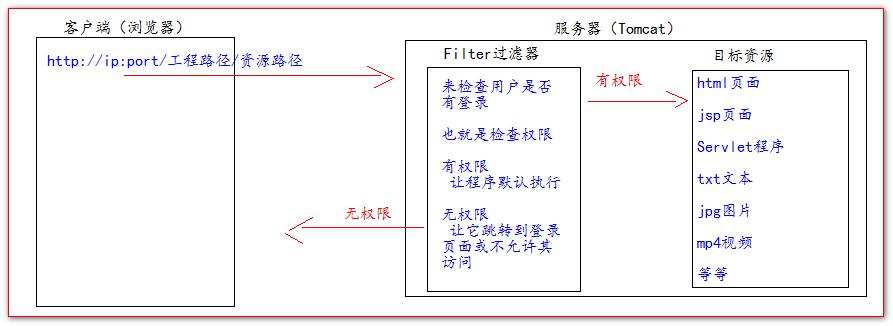
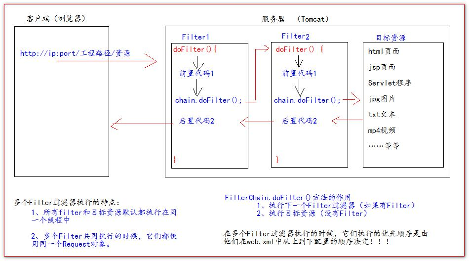
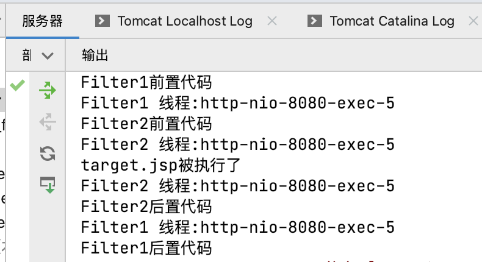

# Filter

## 什么是Filter过滤器

- Filter过滤器它是JavaWeb的三大组件之一。
  
三大组件分别是：**Servlet**程序、**Listener**监听器、**Filter**过滤器

- Filter过滤器它是JavaEE 的规范。也就是接口
  
- Filter过滤器它的作用是：**拦截请求**，过滤响应。

- 拦截请求常见的应用场景有： 
  权限检查,日记操作,事务管理等

## Filter 的初体验

Filter过滤器的使用步骤：
- 编写一个类去实现Filter接口
- 实现过滤方法`doFilter()`
- 到web.xml中去配置Filter的拦截路径



## Filter的生命周期

Filter的生命周期包含几个方法

- **构造器方法**

```java
  public Filter3() {

  }
 ```
  
- **init初始化方法**

```java
public void init(FilterConfig filterConfig) throws ServletException {

    }
```

第1，2步，在web 工程启动的时候执行（Filter 已经创建）

- **doFilter过滤方法**

```java
public void doFilter(ServletRequest servletRequest, ServletResponse servletResponse, FilterChain filterChain) throws IOException, ServletException {

        }
```

第3步，每次拦截到请求，就会执行

- **destroy销毁**

```java
  public void destroy() {

  }
```

第4步，停止web工程的时候，就会执行（停止web 工程，也会销毁Filter 过滤器）

## FilterConfig类

**FilterConfig**类见名知义，它是Filter过滤器的**配置文件类**。

Tomcat每次创建Filter的时候，也会同时创建一个FilterConfig类，这里包含了Filter配置文件的配置信息。

**FilterConfig**类的作用是获取filter过滤器的配置内容

- 获取Filter的名称`filter-name`的内容

- 获取在Filter中配置的`init-param`初始化参数
  
- 获取`ServletContext`对象

### FilterChain过滤器链

>FilterChain 就是过滤器链（多个过滤器如何一起工作）



当访问目标资源时，控制台得到的信息如下:



