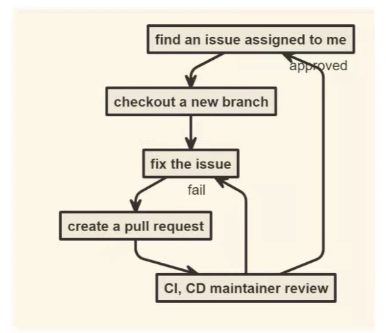

# hustHole 项目随笔

---

?> hustHole 是一个面对我校社区的一个匿名社区，一个社交论坛。

21 年 5 月份，我第一次参与开发 hustHole 的 H5 端 中去。参与开发项目之前，首先先熟悉一下项目开发的流程，也就是如何利用 github 进行团队协作开发。如下图：

(因为我是 maintainer，所以我不需要 fork？)首先把项目从仓库中 clone 下来，然后 checkout 新分支，在本地进行好开发后，提交并 push，最后在 github 上 pull request 请求合并，且让项目负责人可以看得到。

我接到的第一个 issue 是对后端的 api 进行封装，用的库当然就是最热门的 axios 啦。那么在这里，我接触到几个知识盲区：

- #### Typescript 的使用。

?> 因为之前一直没有接触 Ts，那么在项目中去使用 Ts，比单纯用 Js 有好处的多。首先就是 Ts 是一门强类型的语言，他可以约束函数、变量以及函数返回值的类型。我们可以事先约束好变量的类型，当以后运行报错时，就可以根据提示很快就找到错误的地方。

- #### 单元测试

?> 单元测试的目标是隔离程序模块并证明这些单个模块是正确的。单元测试能确保在开发过程的早期就能发现问题，是为了让程序“死得更早”。我们应该从开发的早期就为所有函数和方法编写单元测试，可读性强的单元测试可以使程序员方便地检查代码片断是否依然正常工作。良好设计的单元测试案例覆盖程序单元分支和循环条件的所有路径。采用这种自底向上的测试路径，先测试程序模块再测试模块的集合，一旦变更导致错误发生，借助于单元测试可以快速定位并修复错误。

把后端 API 封装好后，我需要做的就是想一个方案来适配移动端设备。因为项目用的是**Vuetify**组件库，所以可以根据`this.$vuetify.breakpoint.mobile`来判断设备。当然，我事先重新对`this.$vuetify.breakpoint.mobileBreakpoint`做了调整。

在开发中，可能因为插件的问题，所以在上传 git 的时候自动将*assets*中的`.sass`文件编译成了`.css`文件。但是在 Vue-Cli 脚手架中是会自动编译的，不需要自己再生成`.css`文件。
