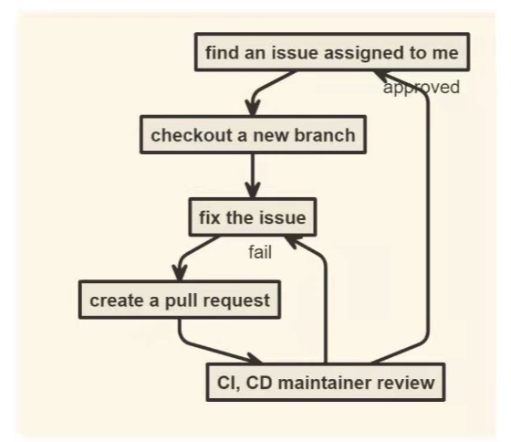

# hustHole 项目随笔

---

?> hustHole 是一个面对我校社区的一个匿名社区，一个社交论坛。

21 年 5 月份，我第一次参与开发 hustHole 的 H5 端 中去。参与开发项目之前，首先先熟悉一下项目开发的流程，也就是如何利用 github 进行团队协作开发。如下图：



(因为我是 maintainer，所以我不需要 fork？)首先把项目从仓库中 clone 下来，然后 checkout 新分支，在本地进行好开发后，提交并 push，最后在 github 上 pull request 请求合并，且让项目负责人可以看得到。

我接到的第一个 issue 是对后端的 api 进行封装，用的库当然就是最热门的 axios 啦。那么在这里，我接触到几个知识盲区：

- #### Typescript 的使用。

?> 因为之前一直没有接触 Ts，那么在项目中去使用 Ts，比单纯用 Js 有好处的多。首先就是 Ts 是一门强类型的语言，他可以约束函数、变量以及函数返回值的类型。我们可以事先约束好变量的类型，当以后运行报错时，就可以根据提示很快就找到错误的地方。

- #### 单元测试

?> 单元测试的目标是隔离程序模块并证明这些单个模块是正确的。单元测试能确保在开发过程的早期就能发现问题，是为了让程序“死得更早”。我们应该从开发的早期就为所有函数和方法编写单元测试，可读性强的单元测试可以使程序员方便地检查代码片断是否依然正常工作。良好设计的单元测试案例覆盖程序单元分支和循环条件的所有路径。采用这种自底向上的测试路径，先测试程序模块再测试模块的集合，一旦变更导致错误发生，借助于单元测试可以快速定位并修复错误。

把后端 API 封装好后，我需要做的就是想一个方案来适配移动端设备。因为项目用的是**Vuetify**组件库，所以可以根据`this.$vuetify.breakpoint.mobile`来判断设备。当然，我事先重新对`this.$vuetify.breakpoint.mobileBreakpoint`做了调整。

在开发中，可能因为插件的问题，所以在上传 git 的时候自动将*assets*中的`.sass`文件编译成了`.css`文件。但是在 Vue-Cli 脚手架中是会自动编译的，不需要自己再生成`.css`文件。

## 5.27

---

今天完成了登陆和注册的组件封装。利用学长自己封装的组件**MO2dialog**,我只需要读懂一些属性就 OK 啦。yysy，学长封装的组件感觉很神奇，我看了会源码，不过还是有点地方不懂。

注册 API 需要前端传入加密后的密码，学长说先不做，让后端多封装一个不需要加密的 API。

这天跟学长腾讯会议，主要聊了 Promise 异步，IO 操作，一些 ts 方面问题，（学长懂的东西好多，我感觉自己学的挺少的）以及最最令我开心的，解决了我困扰已久的问题：**Eslint**插件的使用。

在我学 Vue 的时候我就下载了 Eslint 插件，但是一直无法起作用。后来我去网上搜教程，配置了一下，发现有的时候能有用，有的时候又失效了，这里我贴上我的配置代码：

```js
{
    "workbench.colorTheme": "Community Material Theme Darker High Contrast",
    "workbench.iconTheme": "eq-material-theme-icons-darker",
    "[html]": {
        "editor.defaultFormatter": "esbenp.prettier-vscode"
    },
    "explorer.confirmDragAndDrop": false,
    "editor.fontSize": 20,
    /* "editor.codeActionsOnSave": {
        "source.fixAll": true
    }, */
    "stylelint.enable": true,
    "eslint.options": { // 这个配置可以去掉，vscode 会自动找到根目录下的eslint配置文件， 如果配置了，名字必须对上，不然eslint检测不生效
        "configFile": ".eslintrc.js",
        "extensions": [".vue"]
    },
    "eslint.validate": ["html", "vue", "javascript", "jsx", "typescript"],
    // "eslint.autoFixOnSave": true,
    "emmet.syntaxProfiles": {
        "vue-html": "html",
        "vue": "html",
        "typescript": "html"
    },
    "editor.wordWrapColumn": 220,
    "editor.codeActionsOnSave": {
        "source.fixAll.eslint": true
    },
    "easysass.formats": [
        {
            "format": "expanded",
            "extension": ".css"
        },
        {
            "format": "compressed",
            "extension": ".min.css"
        }
    ],
    "files.autoSave": "afterDelay",
    "php.validate.executablePath": "",
    "explorer.confirmDelete": false,
    "[javascript]": {
        "editor.defaultFormatter": "esbenp.prettier-vscode"
    },
    "gitlens.defaultDateFormat": null,
    "gitlens.defaultDateShortFormat": null,
    "gitlens.advanced.externalDirectoryDiffTool": "",
    "git.path": "D://Git//bin//git.exe",
    "git.autofetch": true,
    "eslint.runtime": "",
    "eslint.codeAction.showDocumentation": {
        "enable": true
    },
    "[vue]": {

        "gitlens.codeLens.scopes": [
            "document"
        ],
        "editor.defaultFormatter": "octref.vetur"
    },
    "[typescript]": {
        "editor.defaultFormatter": "vscode.typescript-language-features"
    },
    "editor.formatOnPaste": true,
    "editor.formatOnSave": true,
    "editor.formatOnType": true,
}
```

后来学长发现，我右下角中 ESLINT 显示一直是个三角形而不是 √，才给我找出了原因所在：我一直都是在 VScode 中的工作区中打开一个大文件夹，然后里面放着各种项目 balabala，但是学长说只有将项目放在工作区首位，**Vetur**和**ESLINT**才可以正常工作。还有，学长说可以在 VScode 设置中搜索*format*，然后把一切的什么`false`弄成`true`,弄了这些之后，我的 ESlint 自动格式化功能终于能正常工作啦。~~~&#x1F308;&#x1F308;

## 5.28

---

今天我根据学长的话，自己提了新 issue：做树洞详情页。我首先想到的就是用动态路由，根据每条树洞的具体 id 来实现。然后再随意加一点 UI 组件，很快的页面整体就完成了。但是在 typescript 方面有一些小问题，类型的问题，还有后端返回数据跟我规定的 type 冲突的问题。我自己摸索了一下发现还是无法搞定，决定等学长有空再请教请教。

## 5.29

---

学长估计出去玩了(手动狗头&#x1F349;)，我就补了补数据结构(学了 js 就感觉只会 js 了)。自己摸索了一下 github：

- 首页的美化
- commit 的时候可以传入 emoji 表情
- issue 中的右侧各种功能？

## 5.30

---

ts 的小问题：复合类型赋值报错

解决方法：

- 关于复合类型的赋值：可以利用断言 `as` 来规定类型。
- 注意一下请求后端返回的数据格式。

然后还有利用 `vue2timeago` 组件来代替了我自己写的一个返回时间差的函数。不得不说别人的组件真香！

## 5.31

---

今天用`live share`同步跟学长一起写代码，看到了学长平时写代码的秘诀，比如 `Ctal`寻找变量位置，以及学到了一些组件间通信的思路和路由守卫的一些知识。

- 把 login 组件封装成了通用模块
- 发现了后端返回 cookie 的一些 bug；
- `http-only`协议是为了防止 XSS 攻击，不让前端访问。然后 Cookie 一般不由客户端来进行操作设置。
- 还有 app-bar 需要再处理一下

## 6.1

---

今天早上，fix 了 login 和 register，现在它们是挂载在 App 上的通用模块啦。
然后还通过路由判断，也成功把 app-bar 封装好啦。现在这个标题栏可以在主页以及详情页中来换切换样式了。

## 6.2

---

今天添加了树洞详情页的手机适配，然后改造了一下添加评论的 dialog，然后学长教了怎么用`sanitize`插件，防止 XSS 攻击，和用`tiptap`来实现更多功能如 placeholder。然后又一起稍微调整了一下样式。

待调整好之后，糊糊涂涂地看着学长部署项目上线了。但是树洞测试版好像没有开放 cors 跨域，所以还在与后端交流 ing。

## 6.3

---

早上完成了随机头像以及触底懒加载功能。现在每一个树洞都有一个随机的主题啦，每个人都可以获取到对应主题的头像。

下午研究了一下学长写的触底组件。我大概总结一下：

- 首先监听页面滚动事件，判断高度差小于 10px(大概)，即为触底
- 然后触发触底事件：
  - 先做个判断，判断数据是否已经全部请求完毕以及现在的 loading 状态是否关闭
  - 然后将 loading 状态打开，执行 ajax 请求数据
  - 请求成功后，更新 datalist，并且判断数据是否全部拿到了，关闭 loading

121212121
