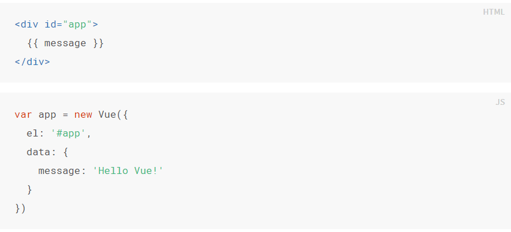
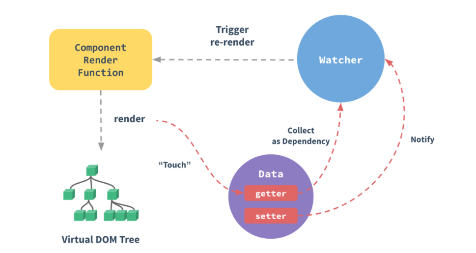
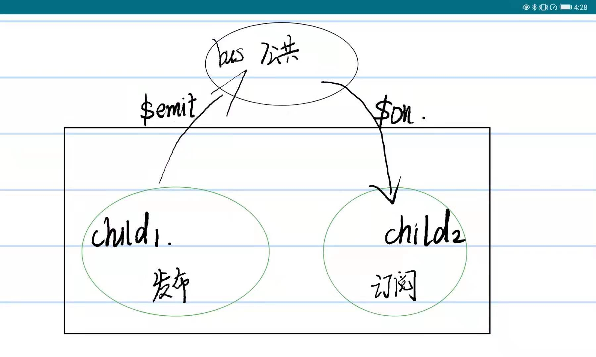
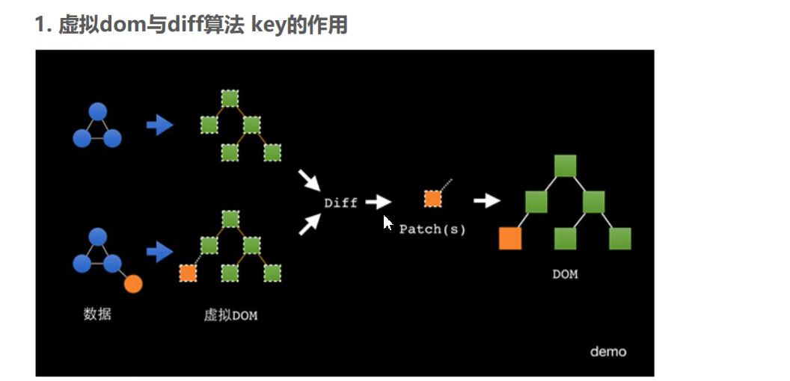
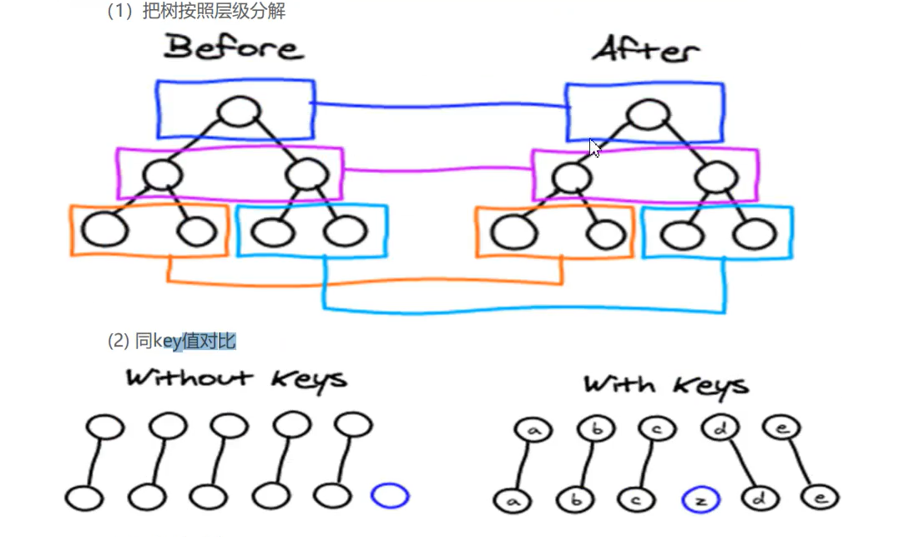
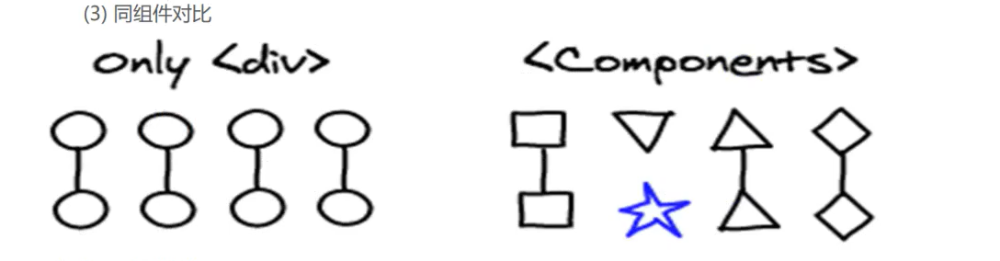

# Vue 2.\*

> 关于**Vue**，是一套用于构建用户界面的渐进式框架。简而言之，核心就是可以在不操作 dom 节点的基础下进行 dom 操作。这里我将介绍我学习 Vue2.\*一路上的知识点，记录下我学习的一些成果

## Vue 的声明式渲染以及简单原理介绍

---

### 1.声明式渲染



这里通过创建一个 Vue 实例,el 是声明 Vue 所渲染的元素节点(地盘)，在 Vue 地盘中，我们可以使用变量(为了不混淆我们把它成为状态),此时状态在 data 属性中进行声明。若不声明，则会报错。声明后可以通过 app.message 对状态进行修改，**所有的响应式变化都将会反映在页面上**

### 2.简单的底层原理

通过原生 JS 中的`Object.defineProperty()`方法，对所有的 Vue 状态进行监听与拦截。


## Vue 的模板语法

---

### 1.基本指令

Vue 中所有的指令后面的值可以是变量或者*表达式*

- `v-show` 表示显示或者隐藏，后面的值为**boolean**值
- `v-if` 表示元素的创建或者删除,后面的值为**boolean**值
- `v-bind`**动态绑定(声明 Vue 地盘)**，后面绑定 dom 节点行内属性,值为变量或者表达式
  **如：**

```html
<div v-bind:class="isActive?'red':'yellow'">切换背景色</div>
```

```javascript
data: {
        isActive: true,
      },
```

**简写：**

```html
<div :class="isActive?'red':'yellow'">切换背景色</div>
```

- `v-on` **绑定事件**
  **如：**

```html
<div v-on:click="handleClick()">click</div>
```

```javascript
methods: {
        handleClick(){
            console.log('click me')
        }
      },
```

**简写：**

```html
<div @click="handleClick()">click</div>
```

这里注意，所有的函数方法都应该放在 Vue 的 methods 属性中。_【注】要是在表达式中没有括号，则可以直接在声明中传入形参获取事件对象；若加入括号，则可以直接在表达式中传入`$event`来获取事件对象_

- `v-for`**循环指令**

```html
<li v-for="(item,index) in dataList">{{item}}</li>
```

这里类比原生 JS 的方法，通过 for-in 或者 for-of 来遍历对象或者数组。

- `v-model` 双向绑定指令
  **可以轻松实现表单输入和应用状态之间的双向绑定，一般用于有 value 属性的表单元素**

- `v-html` 解析 html 标签的指令
  **注意：永远不要在用户可以进行提交的内容中使用，容易导致 XSS、CSRF 攻击**

### 2.条件渲染

`v-if`与`v-else-if`、`v-else`的使用，使用方法类似于 js 中的 if-else 条件语法

_案例：做一个留言板~~_

### 3.列表渲染

Vue 中提供了 Key 值概念，用于跟踪每个节点的身份，从而重用和重排序现有元素(key 类似 id，唯一且不重复)。

> **底层原理**：根据对象或者数组创建虚拟 dom，key 值可以在虚拟 dom 之间对比的时候发挥遍历作用

关于数组的检测更新机制：只有在影响原数组的时候才可以触发更新。比如通过`pop`、`push`、`shift`、`splice`方法等，或者通过`Vue.set`方法来改变数组。

    【注意】Vue 不能通过索引改变数组的方式来渲染页面。

_案例：做一个模糊查询功能_

### 4.Vue 的事件修饰符

`.stop` 用于阻止事件冒泡
`.prevent` 用于阻止默认事件
`.self` 当事件源 target 为自己时，触发事件(避免了事件冒泡)
`.once` 只会触发一次事件
`.capture` 在捕获的时候触发事件
`.passive` 一般用于移动端，可以提升滑动的性能。_每次事件产生的时候，浏览器会自动查询是否有阻止默认行为的动作，加上 passive 后就是为了告诉浏览器，不用查询了，我没有阻止默认行为_

**按键修饰符**
`@keyup.enter=function()` 按回车键即可触发事件
类似的，Vue 还支持`.ctal`、`.enter.ctal`或者直接+Keycode,例如 `@keyup.65=function()` 按 a 键即可触发事件

**表单修饰符**
`.lazy` 在表单元素失去焦点的时候触发(类比 js 中 change 事件)
`.number` 格式化数字(变成 Number 类型)
`.trim` 去首位空格

### 5.表单控件绑定

`v-model`在使用过程中的对于个别表单元素的特性用法

###### 对于多选框，采用数组写法(一定要给每个元素加上 value 值)

```html
<!-- 多选框 -->
<input type="checkbox" v-model="checkGroup" value="vue" />vue
<input type="checkbox" v-model="checkGroup" value="jquery" />jquery
<input type="checkbox" v-model="checkGroup" value="react" />react
```

##### 对于单个选项框，可以绑定一个 boolean 值

##### 对于单选框，绑定 value 值

```html
<!-- 多选框 -->
<input type="radio" v-model="favor" value="vue" />vue
<input type="radio" v-model="favor" value="jquery" />jquery
<input type="radio" v-model="favor" value="react" />react
```

### 6.计算方法

当在 dom 节点中存在一大串逻辑模板的时候，会造成难以维护的问题
比如`<div>{{a.toUpperCase()+"bcdefg"}}</div>`
这时候我们可以使用 Vue 的**Computed**属性。用起来与**methods**中的函数类似，但是他们的区别在于：

> **Computed：注重结果，不加括号** 1.用于逻辑计算，防止模板过程，使用缓存(避免多次执行，优化性能) 2.监听拦截，依赖修改，必须有 return 返回值

例子：

```html
<div id="box">{{total}}</div>
```

```javascript
computed: {
    total() {
        return "sum=100";
     },
},
```

### 7.Mixins 混入

##### 一种分发 Vue 组件中可复用功能的非常灵活的方式

```javascript
let obj = {
  methods: {
    handleClick() {
      console.log("click");
    },
  },
  computed: {
    total() {
      return "sum=100";
    },
  },
};
let vm = new Vue({
  el: "#box",
  mixins: [obj],
});
```

_同名的优先级问题：内部优先级大于外部优先级_

## Vue 中实现 ajax 功能

---

### 1.fetch

`fetch` 是 W3C 的新标准，一般浏览器自带 _兼容性差，基于 Promise 对象_
最简单的例子:

```javascript
fetch(url地址).then((res) => res.json());
```

具体的设置参数:

```javascript
fetch(url地址, options).then((res) => res.json());
```

**options**中必须传入`method`、`headers`和`body`。更具体的设置，请参考文档。

> 注意，fetch 方法默认不带 cookie,若要手动设置带 cookie，则在`options`中传入`credentials:'include'`

### 2.axios(极其推荐)

`axios`是一个第三方库，也是基于 Promise 对象实现的，但是默认自带 cookie

**引用方式** 通过 node npm 进行下载或者直接引入对应 js 文件

**用法**

最简单的用法，`get` 请求：

```javascript
axios.get(url).then((res) => {});
```

`post` 请求：**当传入的 data 是一个对象的时候，会自动与后端传过来的请求头部匹配**

```javascript
axios.post(url, data).then();
```

## Vue 组件

### 1.自定义组件

最简单的例子：

```javascript
Vue.component(name, {
  template,
});
```

`name` 传入自定义组件的名称；`template` 需要渲染的具体节点元素

> 注意：1.关于 name：不能起驼峰格式，不会识别大写字母且自动替换成连接符。  
> 2.template:无代码高亮提示，**只能包含一个根节点**。  
> 3.css 样式只能写在 template 的行内。  
> 4.**组件是一个孤岛，无法直接访问外部组件的状态和方法**。  
> 5.`new Vue()`是一个根节点。  
> 6.**在自定义组件中，data 属性必须位一个函数**，如

```javascript
data(){
  return {
    myname:'abc',
  }
}
```

### 2.局部组件

```javascript
Vue.component("item", {
  template: `
        <div style="background-color: yellow">
          <item-child></item-child>
        </div>
          `,
  components: {
    "item-child": {
      template,
    },
  },
});
```

> 局部组件只能在其父组件中使用

### 3.父子组件通信

#### 一、父传子

```html
<div id="box">
  <navbar myname="热点" :myshow="true" :mydata="a"></navbar>
</div>
```

```javascript
 Vue.component("navbar", {
        template: `
        <div style="background-color: yellow">
        <button v-show="myshow">返回</button>
        <span>narbar-{{myname}}-{{mydata}}</span>
        <button v-show="myshow">首页</button>
        </div>
          `,
        /* props:["myname","myshow"] 接收父组件传来的数据 */
        props: {
          myname: {
            type: String, //数据验证，若类型不匹配则报错
            default: "默认值",
          },
          myshow: {
            type: Boolean,
            default: false,
          },
          mydata: {},
        },
```

**即父组件通过在行内自定义属性将数据传递给子组件，子组件通过`props`属性来接收数据**

#### 二、子传父

```html
<div id="box"><child @myevent="handleEvent"></child></div>
```

```javascript
Vue.component("child", {
  template: `
        <div style="background-color: yellow">
        <span>chick</span><button @click="handleClick">点我</button>
        </div>
          `,
  data() {
    return {
      money: 1000,
    };
  },
  methods: {
    handleClick() {
      this.$emit("myevent", this.money);
    },
  },
});
let vm = new Vue({
  el: "#box",
  data: {
    a: "b",
  },
  methods: {
    handleEvent(data) {
      console.log(data);
    },
  },
});
```

**即子组件通过触发父组件在子组件上设置监听的事件来将数据传递给父组件**

> 这里 Vue 提供 2 个新的事件方法：`.$emit(event,data)`和`.$on(event,callback)`,这两个
> 方法必须在同一个公共实例上才能发挥联合的功能

#### 三、ref 属性(不常用)

**特性：**ref 属性在普通 dom 标签上，会获取原生节点；在 Vue 组件上，可以获取组件对象。
可以获取或者设置*子组件的任何数据*

**通过`.$.refs`来获取所有具备`ref`属性的节点或者组件**

### 4.非父子组件通信

#### 一、中间人模式

- 中间人模式就是两个组件通过子传父, 把数据传送给根组件, 然后根组件在把数据通过父传子传送给需要的子组件
- 就是 组件 A 和组件 B 通信, 组件 A 把数据对象 data 传送给根组件, 根组件接收到后, 再把数据 data 传送给组件 B, 根组件在这个通信过程中就叫中间人.
- 这种方式主要就是用来熟悉组件的父传子和子传父

#### 二、bus 模式(事件总线)

图示：

**即创建一个 bus 组件(空 Vue 实例)，然后对其进行订阅(`$.on`)和发布(`$.emit`)**

#### 三、利用`v-model`实现组件通信

**原理:**

> v-model 其实是通过实现传递 value 和 input 事件监听来实现功能

**例子：**

```html
<myinput v-model="searchText" />
```

**等价于**

```html
<myinput
  v-bind:value="searchText"
  v-on:input="searchText = $event.target.value"
/>
```

为了让它正常工作，这个组件内的 `<input>` 必须：

将其 `value` attribute 绑定到一个名叫 `value` 的 `prop` 上
在其 `input` 事件被触发时，将新的值通过自定义的 `input` 事件抛出

```javascript
Vue.component("custom-input", {
  props: ["value"],
  template: `
    <input
      v-bind:value="value"
      v-on:input="$emit('input', $event.target.value)"
    >
  `,
});
```

### 5.动态组件

**Vue 提供一个组件`<component>`，里面有`is`属性，值为自定义组件的名字**

> `<component>`动态绑定多个组件到它的`is`属性中去。  
> `<keep-alive>`使子组件保留状态，避免重新渲染

**例子**

```html
<div id="box">
  <footer>
    <keep-alive>
      <component :is="isWhich"></component>
    </keep-alive>
    <ul>
      <li @click="isWhich='home'">首页</li>
      <li @click="isWhich='list'">列表</li>
      <li @click="isWhich='shopcar'">购物车</li>
    </ul>
  </footer>
</div>
```

```javascript
Vue.component("home", {
  template: `

<div>home<input type="text" /></div>

`,
});
Vue.component("list", {
  template: `

<div>list</div>
`,
});
Vue.component("shopcar", {
  template: `
<div>shopcar</div>
`,
});
let vm = new Vue({ el: "#box", data: { isWhich: "home" }, methods: {} });
```

### 6.slot 插槽

首先我们来了解组件的渲染原理：**直接将定义好的组件替换在 html 自定义节点上**。  
但和 HTML 元素一样，我们经常需要向一个组件传递内容，Vue 的`slot`元素就起到了很大的作用

```html
<child>
  <button slot="left">左</button>
  <template v-slot:right>
    <button @click="isShow=!isShow">右</button>
  </template>
</child>
```

```javascript
Vue.component("child", {
  template: `
        <div>
          <slot name="left"></slot>
          child
          <slot name="right"></slot>
        </div>`,
});
```

> 组件内传入`slot`属性与组件模板内`name`属性相对应。  
> **新式的 slot**：`v-slot:name` 或简写为`#name`，但这种写法只能写在 components 和`<template>`中

### 7.transition 过渡效果

Vue 提供了`<transition>`的封装组件，在下列情形中，可以给任何元素和组件添加进入/离开过渡

- 条件渲染 (使用 v-if)
- 条件展示 (使用 v-show)
- 动态组件
- 组件根节点

**注意：`<transition>`内只能有一个根节点**

一般配合上以下 6 个过渡的类名来实现过渡效果：

1. `v-enter`：定义进入过渡的开始状态。在元素被插入之前生效，在元素被插入之后的下一帧移除。

2. `v-enter-active`：定义进入过渡生效时的状态。在整个进入过渡的阶段中应用，在元素被插入之前生效，在过渡/动画完成之后移除。这个类可以被用来定义进入过渡的过程时间，延迟和曲线函数。

3. `v-enter-to`：2.1.8 版及以上定义进入过渡的结束状态。在元素被插入之后下一帧生效 (与此同时 `v-enter` 被移除)，在过渡/动画完成之后移除。

4. `v-leave`：定义离开过渡的开始状态。在离开过渡被触发时立刻生效，下一帧被移除。

5. `v-leave-active`：定义离开过渡生效时的状态。在整个离开过渡的阶段中应用，在离开过渡被触发时立刻生效，在过渡/动画完成之后移除。这个类可以被用来定义离开过渡的过程时间，延迟和曲线函数。

6. `v-leave-to`：2.1.8 版及以上定义离开过渡的结束状态。在离开过渡被触发之后下一帧生效 (与此同时 `v-leave` 被删除)，在过渡/动画完成之后移除。
   

对于这些在过渡中切换的类名来说，如果你使用一个没有名字的 `<transition>`，则 `v-` 是这些类名的默认前缀。如果你使用了 `<transition name="my-transition">`，那么 `v-enter` 会替换为 my-transition-enter。

`v-enter-active` 和 `v-leave-active` 可以控制进入/离开过渡的不同的缓和曲线。下面是一个例子：

```css
.dony-enter-active {
  animation: aa 1.5s;
}
.dony-leave-active {
  animation: aa 1.5s reverse;
}
@keyframes aa {
  0% {
    opacity: 0;
    transform: translateX(100px);
  }
  100% {
    opacity: 1;
    transform: translateX(0px);
  }
}
```

```html
<div id="box">
  <button @click="isShow=!isShow">click</button>
  <transition name="dony" appear>
    <div v-show="isShow">显示</div>
  </transition>
</div>
```

```javascript
let vm = new Vue({
  el: "#box",
  data: { isShow: true },
});
```

> `transition`的行内属性：
>
> 1.  `name`：定义类名的前缀。
> 2.  `appear`： 表示页面初始的时候就执行过渡效果。
> 3.  `mode`：设置过渡模式，只有 2 个值分别是`in-out`和`out-in`。

### 8.多元素过渡(设置 key 值)

关于 `Vue` 的元素渲染的原理，先根据数组创建虚拟 `dom` 树，然后由 `diff` 算法来比对新旧虚拟 `dom` 树，若 `dom` 标签没有
变化的时候，为了效率只会替换相同标签内部的内容，就会有可能达不到我们想要的过渡效果。因此我们必须要通过 key 来标记以让 `Vue` 去区别他们。




实例：

```html
<transition>
  <button v-if="isEditing" key="save">Save</button>
  <button v-else key="edit">Edit</button>
</transition>
```

### 9.多组件过渡(利用动态组件)

实例：

```html
<transition name="component-fade" mode="out-in">
  <component v-bind:is="view"></component>
</transition>
```

```javascript
new Vue({
  el: "#transition-components-demo",
  data: {
    view: "v-a",
  },
  components: {
    "v-a": {
      template: "<div>Component A</div>",
    },
    "v-b": {
      template: "<div>Component B</div>",
    },
  },
});
```

```css
.component-fade-enter-active,
.component-fade-leave-active {
  transition: opacity 0.3s ease;
}
.component-fade-enter, .component-fade-leave-to
/* .component-fade-leave-active for below version 2.1.8 */ {
  opacity: 0;
}
```

### 10.列表过渡(利用`<transition-group>`)

因为`transition`组件只能包含一个根元素，因此我们利用`<transition-group>`来实现列表过渡效果。

**关于`<transition-group>`特性**

> 不同于 `<transition>`，它会以一个真实元素呈现：默认为一个 `<span>`。你也可以通过 `tag `attribute 更换为其他元素。  
> 过渡模式不可用，因为我们不再相互切换特有的元素。  
> 内部元素总是需要提供唯一的 key attribute 值。  
> CSS 过渡的类将会应用在内部的元素中，而不是这个组/容器本身。

实例：

```html
<transition-group name="dony" tag="ul">
  <li v-for="(item,index) in dataList" :key="item">
    {{item}}
    <button @click="handleDel(index)">del</button>
  </li>
</transition-group>
```

## vue 组件的生命周期(也称为钩子函数)

---

Vue 中组件以及 vm 实例都有着它们自己的生命周期，一共有 8 个阶段：

1. beforeCreate 在组件创建之前
2. created 组件创建、Vue 设置了 get、set 拦截之后，一般用于一些初始化工作
3. beforeMount 在组件挂载之前 **注意：在服务端渲染的时候，这个钩子函数会分别在客户端、服务端各自触发一次**
4. Mounted 组件挂载完之后
5. beforeUpdate 组件状态更新之前
6. updated 组件更新之后
   **注意：在组件的状态更新之前，异步更新 dom 节点**
7. beforeDestroy 在组件销毁之前
8. destroyed 在组件销毁之后，一般用于删除组件内设置的 window 事件，以及定时器等

为了更好的理解生命周期的各个阶段，这里引入官方文档中的一张图


## Vue 自定义指令

---

同学们在运用 Vue 时，根本就不需要用原生 JS 来操作 dom 节点就可以实现各种功能。但是，总有的时候 Vue 内置指令不能够解决我们的问题，这时候就可以利用自定义指令来封装对底层 dom 操作的 JS 代码。
举个聚焦输入框的例子，如下：

<div style="height:50px;width:100%;border:1px solid black;"><input style="margin:10px auto;display:block;"></div>

要实现：当页面加载时，该元素将获得焦点，那么就可以利用指令来实现：

```js
// 注册一个全局自定义指令 `v-focus`
Vue.directive("focus", {
  // 当被绑定的元素插入到 DOM 中时……
  inserted: function (el) {
    // 聚焦元素
    el.focus();
  },
});
```

如果想注册局部指令，组件中也接受一个 directives 的选项：

```js
directives: {
  focus: {
    // 指令的定义
    inserted: function (el) {
      el.focus()
    }
  }
}
```

然后你就可以在你的 html 元素上直接使用了

```html
<input v-focus />
```

### 钩子函数

有细心的小伙伴发现了，在上面的例子中，我们利用了`inserted`的一个钩子函数。是的，组件存在生命周期，Vue 指令也同样存在生命周期。
一个指令定义对象可以提供如下几个钩子函数 (均为可选)：

- `bind`：只调用一次，指令第一次绑定到元素时调用。在这里可以进行一次性的初始化设置。

- `inserted`：被绑定元素插入父节点时调用 (仅保证父节点存在，但不一定已被插入文档中)。

- `update`：所在组件的 VNode 更新时调用，但是可能发生在其子 VNode 更新之前。指令的值可能发生了改变，也可能没有。但是你可以通过比较更新前后的值来忽略不必要的模板更新 (**这里注意要跟组件的 updated 作区分**)。

- `componentUpdated`：指令所在组件的 VNode 及其子 VNode 全部更新后调用。

- `unbind`：只调用一次，指令与元素解绑时调用。

### 钩子函数参数

指令钩子函数会被传入以下参数：

- `el`：指令所绑定的元素，可以用来直接操作 DOM。
- `binding`：一个对象，包含以下 property：
  - `name`：指令名，不包括 v- 前缀。
  - `value`：指令的绑定值，例如：`v-my-directive="1 + 1" `中，绑定值为 `2`。
    `oldValue`：指令绑定的前一个值，仅在 update 和 componentUpdated 钩子中可用。无论值是否改变都可用。
  - `expression`：字符串形式的指令表达式。例如 `v-my-directive="1 + 1" `中，表达式为 `"1 + 1"`。
  - `arg`：传给指令的参数，可选。例如 `v-my-directive:foo` 中，参数为 `"foo"`。
  - `modifiers`：一个包含修饰符的对象。例如：`v-my-directive.foo.bar` 中，修饰符对象为 `{ foo: true, bar: true }`。
- `vnode`：Vue 编译生成的虚拟节点。
- `oldVnode`：上一个虚拟节点，仅在 update 和 componentUpdated 钩子中可用。

> 除了 `el` 之外，其它参数都应该是只读的，切勿进行修改。个人认为，一般自定义指令利用场景不多，适当了解一下。

## 过滤器

Vue 提供了一种很方便的过滤器写法 _(支持串联写法)_，可以写在指令后面或者在双大括号插值式子中：

```html

```

```html
{{item | filter1 | filter 2}}
```

###### 定义方式

```js
Vue.filter("filter1", function (value) {
  // 过滤参数内的数据
});
```

或者在组件内定义

```js
filters: {
  filter2: function (value) {
    // 过滤参数内的数据
  }
}
```
