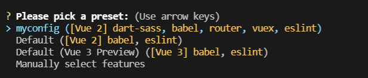
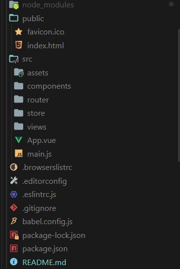

# Vue Cli

?> 利用 Vue 脚手架快速创建一个项目框架,运用官方的话来说就是： Vue CLI 是一个基于 Vue.js 进行快速开发的完整系统，提供：

- 通过 @vue/cli 实现的交互式的项目脚手架。
- 通过 @vue/cli + @vue/cli-service-global 实现的零配置原型开发。
- 一个运行时依赖 (@vue/cli-service)，该依赖：
  - 可升级；
  - 基于 webpack 构建，并带有合理的默认配置；
  - 可以通过项目内的配置文件进行配置；
  - 可以通过插件进行扩展。
- 一个丰富的官方插件集合，集成了前端生态中最好的工具。
- 一套完全图形化的创建和管理 Vue.js 项目的用户界面。

?> Vue CLI 致力于将 Vue 生态中的工具基础标准化。它确保了各种构建工具能够基于智能的默认配置即可平稳衔接，这样你可以专注在撰写应用上，而不必花好几天去纠结配置的问题。

## 安装

---

```node
npm install -g @vue/cli
# OR
yarn global add @vue/cli
```

安装之后，你就可以在命令行中访问 vue 命令。你可以通过简单运行 vue，看看是否展示出了一份所有可用命令的帮助信息，来验证它是否安装成功。

## 创建一个项目 vue create

---

运行以下命令来创建一个新项目：

```node
vum create myapp
```

你会被提示选取一个 preset。你可以选默认的包含了基本的 Babel + ESLint 设置的 preset，也可以选“手动选择特性”来选取需要的特性。



这里`myconfig`是我曾经设置过的配置，如果是第一次使用的话，可以根据提示信息一步一步进行自我需求的一个配置或者看[官方网站](https://cli.vuejs.org/zh)。

然后即可创建一个初始的项目框架，目录框架如下：



在`package.json`中我们可以看到：

```js
"scripts": {
    "serve": "vue-cli-service serve",//启动一个服务器
    "build": "vue-cli-service build",//打包
    "lint": "vue-cli-service lint"//以eslint标准修正代码格式
  },
```

这是初始化时给我们提供的 3 条命令（当然也可以根据个人喜好进行更改）

!> 这里要注意的是，vuecli 使用`eslint`代码风格要求，只要代码格式不对就是自动报错。当然也可以对其进行修改，在文件`eslintrc.js`中可以自己配置。

## 项目框架基本介绍

---

这里我将会对项目框架作一个基本的介绍，来帮助大家认识 vuecil，以及如何去利用它去进行开发项目。

- 首先，*src*文件夹是我们开发项目的一个环境，基本上所有的操作都会在这里进行。
  - *assets*文件夹存放的是项目的资源。例如图片等。
  - *components*文件夹存放的是项目的可复用组件。例如各页面都需要的*tabbar*，*navbar*等等。
  - *router*文件夹是我们整个项目的路由地址，所有的路由操作配置都会在里面进行。
  - *store*文件夹是我们项目的集中式存储管理应用的所有组件的状态、变量或函数的地方。例如**Vuex**
  - *views*文件夹是我们项目主要视图存储地方。比如首页。
  - *main.js*文件是进行引入以及挂载功能的，`Vue-cli`已经帮我们搭建好了，一般不去动它。
  - *App.vue*是我们整个项目的一个呈现页面。

## Vue 的单组件模式开发 (SFC 模式)

---

在很多 Vue 项目中，我们使用 `Vue.component` 来定义全局组件，紧接着用 `new Vue({ el: '#container '})` 在每个页面内指定一个容器元素。

这种方式在很多中小规模的项目中运作的很好，在这些项目里 JavaScript 只被用来加强特定的视图。但当在更复杂的项目中，或者你的前端完全由 JavaScript 驱动的时候，下面这些缺点将变得非常明显：

- **全局定义 (Global definitions)** 强制要求每个 component 中的命名不得重复
- **字符串模板 (String templates)** 缺乏语法高亮，在 HTML 有多行的时候，需要用到丑陋的 \
- **不支持 CSS (No CSS support)** 意味着当 HTML 和 JavaScript 组件化时，CSS 明显被遗漏
- **没有构建步骤 (No build step)** 限制只能使用 HTML 和 ES5 JavaScript，而不能使用预处理器，如 Pug (formerly Jade) 和 Babel

?> **但是，文件扩展名为 .vue 的 single-file components (单文件组件) 为以上所有问题提供了解决方法**

我们可以简单的举一个例子,在一个基本的`.vue`文件中

```js,html,css
<template>
</template>
<script>
export default {
  data: () => ({
    //
  })
}
</script>
<style>
</style>
```

现在我们可以获得：

- **完整语法高亮**
- **CommonJS 模块**
- **组件作用域的 CSS**

- ?> 同时，我们还可以解决了**css 命名重复**问题。只要在`<style>`中加上`scoped`属性，在渲染的时候会给该组件每一个 dom 元素附上独一无二的`data`属性，从而使各个组件的样式私有化。
- ?> 我们还可以使用预处理器来编写 css，例如：只需要在`<style>`中加上`lang='scss'`属性，就可以直接使用`scss`语法了。

## 关于跨域

---

?> vue.config.js 是一个可选的配置文件,关于 Vue 项目的配置都在里面进行。

如果你的前端应用和后端 API 服务器没有运行在同一个主机上，你需要在开发环境下将 API 请求代理到 API 服务器。这个问题可以通过 vue.config.js 中的 devServer.proxy 选项来配置。

devServer.proxy 可以是一个指向开发环境 API 服务器的字符串：

```js
module.exports = {
  // 选项... 配置完要重启服务器
  /* 这里是配置反向代理信息 */
  devServer: {
    proxy: {
      "/ajax": {
        target: "https://m.maoyan.com",
        changeOrigin: true,
      },
    },
  },
};
```

在这里，只要前端请求 ajax 的 url 中匹配到了`/ajax`字符串，就会自动代理成`"https://m.maoyan.com"`
