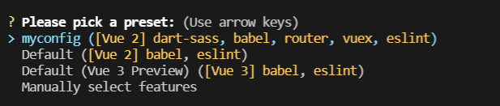
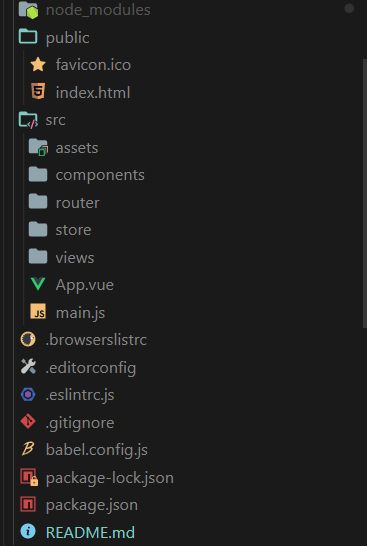

# Vue Cli

?> 利用 Vue 脚手架快速创建一个项目框架,运用官方的话来说就是： Vue CLI 是一个基于 Vue.js 进行快速开发的完整系统，提供：

- 通过 @vue/cli 实现的交互式的项目脚手架。
- 通过 @vue/cli + @vue/cli-service-global 实现的零配置原型开发。
- 一个运行时依赖 (@vue/cli-service)，该依赖：
  - 可升级；
  - 基于 webpack 构建，并带有合理的默认配置；
  - 可以通过项目内的配置文件进行配置；
  - 可以通过插件进行扩展。
- 一个丰富的官方插件集合，集成了前端生态中最好的工具。
- 一套完全图形化的创建和管理 Vue.js 项目的用户界面。

?> Vue CLI 致力于将 Vue 生态中的工具基础标准化。它确保了各种构建工具能够基于智能的默认配置即可平稳衔接，这样你可以专注在撰写应用上，而不必花好几天去纠结配置的问题。

## 安装

---

```node
npm install -g @vue/cli
# OR
yarn global add @vue/cli
```

安装之后，你就可以在命令行中访问 vue 命令。你可以通过简单运行 vue，看看是否展示出了一份所有可用命令的帮助信息，来验证它是否安装成功。

## 创建一个项目 vue create

---

运行以下命令来创建一个新项目：

```node
vum create myapp
```

你会被提示选取一个 preset。你可以选默认的包含了基本的 Babel + ESLint 设置的 preset，也可以选“手动选择特性”来选取需要的特性。



这里`myconfig`是我曾经设置过的配置，如果是第一次使用的话，可以根据提示信息一步一步进行自我需求的一个配置或者看[官方网站](https://cli.vuejs.org/zh)。

然后即可创建一个初始的项目框架，目录框架如下：



在`package.json`中我们可以看到：

```js
"scripts": {
    "serve": "vue-cli-service serve",//启动一个服务器
    "build": "vue-cli-service build",//打包
    "lint": "vue-cli-service lint"//以eslint标准修正代码格式
  },
```

这是初始化时给我们提供的 3 条命令（当然也可以根据个人喜好进行更改）

!> 这里要注意的是，vuecli 使用`eslint`代码风格要求，只要代码格式不对就是自动报错。当然也可以对其进行修改，在文件`eslintrc.js`中可以自己配置。

## 项目框架基本介绍

---

这里我将会对项目框架作一个基本的介绍，来帮助大家认识 vuecil，以及如何去利用它去进行开发项目。

### src/main.js

---
