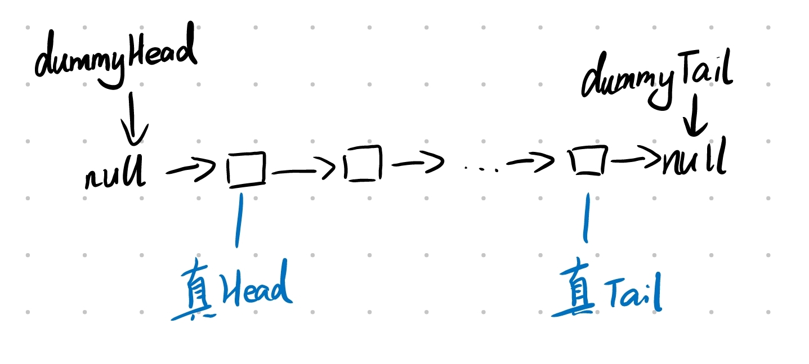

# leetcode----算法日记

---

现在是 2021 的 7 月份初，我刚好大二结束了。为了想在大三可以通过自己的努力去大厂实习，除了学习前端知识外，还得补补一些计算机基础知识：数据结构以及算法。因此我决定开始每日至少刷一道 leetcode 题。以前的我是非常讨厌做算法题的，因为我很菜 但是希望能通过努力来弥补这一点。奥里给~~

## 数组

### leetcode 217.存在重复元素

给定一个整数数组，判断是否存在重复元素。如果存在一值在数组中出现至少两次，函数返回 true 。如果数组中每个元素都不相同，则返回 false 。

**法一：Set 类** `2021.7.12`
::: tip
思路：这种去重问题，可以用 ES6 新类 Set 来解决，因为 Set 本身就是不会将重复的元素添加进去，所以我们可以遍历数组将所以数据添加到 Set 中，再比较两者的长度
:::

```js
var containsDuplicate = function (nums) {
  let list = new Set();
  for (let i = 0; i < nums.length; i++) {
    list.add(nums[i]);
  }
  return list.size !== nums.length;
};
```

### leetcode 53.最大子序和

给定一个整数数组 nums ，找到一个具有最大和的连续子数组（子数组最少包含一个元素），返回其最大和。

**法一：贪心算法** `2021.7.12`

> 思路：遍历数组，在每一步的时候，比较当前数以及当前和，若当前和小于当前数，则可以无情的抛弃之前的和啦。然后再比较记录的最大和以及刚刚比较出来的最大值，若大于最大和则更新。最后返回最大和。

```js
var maxSubArray = function (nums) {
  if (nums.length === 1) return nums[0];
  let cur_sum = (max_sum = nums[0]);
  for (let i = 1; i < nums.length; i++) {
    cur_sum = Math.max(nums[i], nums[i] + cur_sum);
    max_sum = Math.max(cur_sum, max_sum);
  }
  return max_sum;
};
```

**法二：分治** `2021.7.12`

```js
function Status(l, r, m, i) {
  this.lSum = l;
  this.rSum = r;
  this.mSum = m;
  this.iSum = i;
}

const pushUp = (l, r) => {
  const iSum = l.iSum + r.iSum;
  const lSum = Math.max(l.lSum, l.iSum + r.lSum);
  const rSum = Math.max(r.rSum, r.iSum + l.rSum);
  const mSum = Math.max(Math.max(l.mSum, r.mSum), l.rSum + r.lSum);
  return new Status(lSum, rSum, mSum, iSum);
};

const getInfo = (a, l, r) => {
  if (l === r) {
    return new Status(a[l], a[l], a[l], a[l]);
  }
  const m = (l + r) >> 1; //除以2
  const lSub = getInfo(a, l, m);
  const rSub = getInfo(a, m + 1, r);
  return pushUp(lSub, rSub);
};

var maxSubArray = function (nums) {
  return getInfo(nums, 0, nums.length - 1).mSum;
};
```

这里直接上代码，因为分治在这道题中并不是最好的解法，而且难以理解。对于大规模查询的情况下，这种方法的优势便体现了出来。这棵树就是上文提及的一种神奇的数据结构——线段树。

> 思路： 分治的思想就是将[l,r]的区间分成左右两部分[l,m],[m+1,r]，这里的 m 就是 `l+r/2`。然后再对子区间进行同样的操作，递归。那么在这里，我们需要维护 4 个变量：

- `lSum` 表示 [l,r] 内以 l 为左端点的最大子段和。那么[l,r]的 lSum 可能是左区间的 iSum 或者左区间的 iSum + 右区间的 lSum。
- `rSum` 表示 [l,r] 内以 r 为右端点的最大子段和。同理
- `mSum` 表示 [l,r] 内的最大子段和。这个就有 3 种情况了：可能是左、右区间的 mSum，或者跨越了中间，即左区间的 rSum + 右区间的 lSum。
- `iSum` 表示 [l,r] 的区间和。那么[l,r]的 iSum 就是左右两区间的 iSum 之和。

### leetcode 1.两数之和

给定一个整数数组 nums  和一个整数目标值 target，请你在该数组中找出 和为目标值 target  的那   两个   整数，并返回它们的数组下标。

你可以假设每种输入只会对应一个答案。但是，数组中同一个元素在答案里不能重复出现。

你可以按任意顺序返回答案。

**法一：暴力解法** `2021.7.13`

> 思路：没啥好说的，两个 for 遍历完事了。时间复杂度 O(n^2)

```js
var twoSum = function (nums, target) {
  for (let i = 0; i < nums.length; i++) {
    for (let j = i + 1; j < nums.length; j++) {
      if (nums[i] + nums[j] === target) return [i, j];
    }
  }
  return [];
};
```

**法二：哈希表** `2021.7.13`

> 思路：我们可以换一种想法，每次遍历用 target-nums[i]来求出另一个值，这样的话只要寻找到另一个值，则 OK；找不到则继续遍历。时间复杂度 O(n^2)

```js
var twoSum = function (nums, target) {
  let hashMap = {};
  for (let i = 0; i < nums.length; i++) {
    let another = target - nums[i];
    if (another in hashMap) return [i, hashMap[another]];
    hashMap[nums[i]] = i;
  }
  return [];
};
```

### leetcode 88.合并 2 个有序数组

**法一：JS 的 API** `2021.7.13`

它这道题不可以改变 num1 的指向，即 num1=。。。。。就很离谱。

```js
var merge = function (nums1, m, nums2, n) {
  nums1.splice(m, nums1.length - m, ...nums2);
  nums1.sort((a, b) => a - b);
};
```

**法二：双指针** `2021.7.13`

> 思路：链表的归并排序，我就不说了，可以看下面的题。 这题可以从头往前用双指针，代码如下：

```js
var merge = function(nums1, m, nums2, n) {
    int last=m+n-1;
    while(n){
        if(m==0||nums1[m-1]<=nums2[n-1]){
            nums1[last--]=nums2[--n];
        }else{
            nums1[last--]=nums1[--m];
        }
    }
}
```

### leetcode 350. 两个数组的交集 II

给定两个数组，编写一个函数来计算它们的交集。输出结果中每个元素出现的次数，应与元素在两个数组中出现次数的最小值一致。我们可以不考虑输出结果的顺序。

**进阶：**

- 如果给定的数组已经排好序呢？你将如何优化你的算法？
- 如果  nums1  的大小比  nums2  小很多，哪种方法更优？
- 如果  nums2  的元素存储在磁盘上，内存是有限的，并且你不能一次加载所有的元素到内存中，你该怎么办？

**法一：哈希表** `2021.7.14`

> 思路：首先遍历数组一，将元素出现的个数存在哈希表中，然后遍历数组二，如果存在于哈希表中的元素出现的次数大于 0，则 push 到结果中，并且次数减小。这样就可以保证输出元素在两个数组中出现次数的最小值啦。这个方法的时间、空间复杂度都为 O(n)

```js
var intersect = function (nums1, nums2) {
  let res = [];
  let hashMap = {};
  for (let i = 0; i < nums1.length; i++) {
    if (nums1[i] in hashMap) {
      hashMap[nums1[i]]++;
    } else {
      hashMap[nums1[i]] = 1;
    }
  }
  for (let i = 0; i < nums2.length; i++) {
    if (hashMap[nums2[i]] > 0) {
      res.push(nums2[i]);
      hashMap[nums2[i]]--;
    }
  }
  return res;
};
```

**法二：双指针** `2021.7.14`

> 思路：先给两个数组排好序，这样的话每个数组里相同的元素就会挨在一起了。然后通过两个指针分别遍历 2 个数组即可。这个方法时间复杂度为 O(nlogn) ，空间复杂度是 1

```js
var intersect = function (nums1, nums2) {
  nums1.sort((a, b) => a - b);
  nums2.sort((a, b) => a - b);
  let res = [];
  let p1 = 0;
  let p2 = 0;
  while (p1 < nums1.length && p2 < nums2.length) {
    if (nums1[p1] > nums2[p2]) {
      p2++;
    } else if (nums1[p1] < nums2[p2]) {
      p1++;
    } else {
      res.push(nums1[p1]);
      p1++;
      p2++;
    }
  }
  return res;
};
```

### leetcode 121. 买卖股票的最佳时机

给定一个数组 prices ，它的第  i 个元素  prices[i] 表示一支给定股票第 i 天的价格。
你只能选择 某一天 买入这只股票，并选择在 未来的某一个不同的日子 卖出该股票。设计一个算法来计算你所能获取的最大利润。
返回你可以从这笔交易中获取的最大利润。如果你不能获取任何利润，返回 0 。

_示例:_

```js
输入：[7,1,5,3,6,4]
输出：5
解释：在第 2 天（股票价格 = 1）的时候买入，在第 5 天（股票价格 = 6）的时候卖出，最大利润 = 6-1 = 5 。
     注意利润不能是 7-1 = 6, 因为卖出价格需要大于买入价格；同时，你不能在买入前卖出股票。
```

**法一：** `2021.7.14`

> 思路：记录下最小值以及每天理论上可获取的最大利润。

```js
var maxProfit = function (prices) {
  if (prices.length < 1) return 0;
  let max = 0;
  let min = prices[0];
  for (let i = 1; i < prices.length; i++) {
    max = Math.max(max, prices[i] - min);
    min = Math.min(prices[i], min);
  }
  return max;
};
```

## 链表

### leetcode234.回文链表

**问题**：请判断一个链表是否为回文链表。

> 思路：利用快慢指针，慢指针一次走一步，快指针一次走两步。对于奇数链表，当快指针走到尾节点的时候，慢指针走到中间节点；对于偶数链表，当快指针走到倒数第二个节点的时候，慢指针走到前半段的尾节点处。同时，在慢指针走的时候讲前半段链表反转。（如果是奇数链表，慢指针再走一步，因为中间节点不需要比较）然后比较前半段反转的链表和后半段链表即可。

**代码实现**

```js
/**
 * Definition for singly-linked list.
 * function ListNode(val, next) {
 *     this.val = (val===undefined ? 0 : val)
 *     this.next = (next===undefined ? null : next)
 * }
 */
/**
 * @param {ListNode} head
 * @return {boolean}
 */
var isPalindrome = function (head) {
  let slow = head;
  let pre = null;
  let reverse = null;
  while (head && head.next) {
    pre = slow;
    slow = slow.next;
    head = head.next.next;
    /* 反转前半链表 */
    pre.next = reverse;
    reverse = pre;
  }
  if (head) slow = slow.next;
  while (slow) {
    if (slow.val === pre.val) {
      slow = slow.next;
      pre = pre.next;
    } else return false;
  }
  return true;
};
```

### 剑指 24.反转链表

> 思路：利用前中后 3 个指针，边遍历边反转。

**代码实现:**

```js
/**
 * Definition for singly-linked list.
 * function ListNode(val) {
 *     this.val = val;
 *     this.next = null;
 * }
 */
/**
 * @param {ListNode} head
 * @return {ListNode}
 */
var reverseList = function (head) {
  let pre = null;
  let current = head;
  if (!head) return head;
  let ahead = head.next;
  while (current) {
    current.next = pre;
    pre = current;
    current = ahead;
    if (ahead) {
      ahead = ahead.next;
    }
  }
  return pre;
};
```

### leetcode21.合并两顺序表

> 思路：主要思路如下图。这里我第一次出错的原因是循坏条件判断错误，我用的是`l1||l2`，企图想一次性把所有条件都写在一起，这样的话`l1.val`可能为空，则出错。第 2 次的话，是遍历的错误，我写成了`l=l1` / `l=l2` ，这样的话 l 根本就没有 next，整个链表就支零破碎了。


**代码实现：**

```js
/**
 * Definition for singly-linked list.
 * function ListNode(val, next) {
 *     this.val = (val===undefined ? 0 : val)
 *     this.next = (next===undefined ? null : next)
 * }
 */
/**
 * @param {ListNode} l1
 * @param {ListNode} l2
 * @return {ListNode}
 */
var mergeTwoLists = function (l1, l2) {
  if (l1 === null) return l2;
  if (l2 === null) return l1;
  let head = new ListNode(-1);
  let l = head;
  while (l1 != null && l2 != null) {
    if (l1.val > l2.val) {
      l.next = l2;
      l2 = l2.next;
    } else {
      l.next = l1;
      l1 = l1.next;
    }
    l = l.next;
  }
  if (l1 === null) l.next = l2;
  if (l2 === null) l.next = l1;
  return head.next;
};
```

### 剑指 offer 22. 链表第 n 个节点 `2021.7.5`

- 输入一个链表，输出该链表中倒数第 k 个节点。为了符合大多数人的习惯，本题从 1 开始计数，即链表的尾节点是倒数第 1 个节点。

实例：

```
给定一个链表: 1->2->3->4->5, 和 k = 2.

返回链表 4->5.
```

> 思路：首先遍历一遍链表，获取链表长度 n，然后重新遍历 n-k 次得到倒数第 k 个节点

```js
/**
 * Definition for singly-linked list.
 * function ListNode(val) {
 *     this.val = val;
 *     this.next = null;
 * }
 */
/**
 * @param {ListNode} head
 * @param {number} k
 * @return {ListNode}
 */
var getKthFromEnd = function (head, k) {
  if (!head.next) return head;
  let traverse = head;
  let length = 1;
  while (traverse.next) {
    traverse = traverse.next;
    length++;
  }
  if (k === 1) return traverse;
  if (k > length) return null;
  for (let i = 0; i < length - k; i++) {
    head = head.next;
  }
  return head;
};
```

---

**二刷**

> 思路：上述的做法实际上遍历了 2 次链表，感觉还可以再优化一下。看了一下各路大佬的题解，发现一种快慢指针法只需要遍历一次链表即可。关键是让快指针先移动 k-1 步，这样的话快慢指针就分别指向所求链表的尾、头节点了。

```js
var getKthFromEnd = function (head, k) {
  if (!head) return null;
  let fast = head;
  let slow = head;
  for (let i = 0; i < k - 1; i++) {
    if (!fast) return null; /* 即 k 大于链表的长度 */
    fast = fast.next;
  }
  while (fast.next) {
    slow = slow.next;
    fast = fast.next;
  }
  return slow;
};
```

### leetcode 876. 求链表的中间节点 `2021.7.6`

给定一个头结点为 head 的非空单链表，返回链表的中间结点。如果有两个中间结点，则返回第二个中间结点。

> 思路：因为之前刷过快慢指针的题，所以我一看到要获取中间节点，我一下子就想到了快慢指针。

**代码如下：**

```js
/**
 * @param {ListNode} head
 * @return {ListNode}
 */
var middleNode = function (head) {
  if (!head.next) return head;
  let slow = head;
  let fast = head;
  /* 兼容奇数和偶数长度的链表 */
  while (fast && fast.next) {
    slow = slow.next;
    fast = fast.next.next;
  }
  return slow;
};
```

### leetcode 146. LRU 缓存机制 `2021.7.7`

> 思路：这道题我们首先要想到，新的在前，旧的在后，若超出存贮极限，则把最旧的给抛弃掉。除此之外，当每次插入、更新或者获取节点的时候，都得把节点放在最前面也就是从旧变新了。因此我们可以定义几个方法：`_moveToHead`,`_remove`,`_isFull`。**`get方法`**：若 key 不存在 return -1；若存在则获取 value 并且 moveToHead。**`put`**：key 存在，则更新 value 并且 moveToHead；key 不存在，判断是否满了，若满了则删除尾节点；然后插入新节点。

> 这道题最难的地方，我认为在于时间复杂度需要 O(1)。存储节点我们首先想到的就是数组或者链表，但是当我们插入删除以及获取的时候，它们都不可避免的需要 0(n)。因此，我选择使用链表来执行插入删除，使用哈希表来获取，这样的话时间复杂度就都满足 0(1)了。hashMap 存储的是 key->node，链表存储的是 node。

```js
//第一次：
class Node {
  constructor(key, value) {
    this.key = key;
    this.data = value;
    this.next = null;
    this.prev = null;
  }
}
class LRUCache {
  constructor(capacity) {
    this.capacity = capacity;
    this.usedSpace = 0;
    this.head = new Node(null, null);
    this.tail = new Node(null, null);
    this.head.next = this.tail;
    this.tail.prev = this.head;
    this.hashmap = {};
  }
  _isFull() {
    return this.usedSpace == this.capacity ? true : false;
  }
  _remove(node) {
    node.prev.next = node.next;
    node.next.prev = node.prev;
    node.next = null;
    node.prev = null;
    return node;
  }
  _moveToHead(node) {
    let current = this.head;
    this.head = node;
    node.next = current;
    current.prev = node;
  }
  get(key) {
    if (key in this.hashmap) {
      let node = this._remove(this.hashmap[key]);
      this._moveToHead(node);
      return node.value;
    } else {
      return -1;
    }
  }
  put(key, value) {
    //
    if (!this.hashmap[key]) {
      let newNode = new Node(key, value);
      if (!this._isFull()) {
        this._moveToHead(newNode);
        this.hashmap[key] = newNode;
        this.usedSpace++;
      } else {
        delete this.hashmap[this.tail.key];
        this.hashmap[key] = newNode;
        this.tail = this.tail.prev;
        this.tail.next = null;
        this._moveToHead(newNode);
      }
    } else {
      this.hashmap[key].value = value;
      let node = this._remove(this.hashmap[key]);
      this._moveToHead(node);
    }
  }
}
```

**那么众所周知第一次往往都会失败，原因有 2 个：**

- 首先节点类的 value 写错成了 data (这个写错的地方花了我好久才发现)
- remove 方法中，如果删除的是尾节点的话则没有 node.next.prev，会报错

因此我采用两个固定的 dummyHead 以及 dummyTail 来记录下虚拟头尾节点


代码如下：

```js
class DoubleLinkedListNode {
  constructor(key, value) {
    this.key = key;
    this.value = value;
    this.prev = null;
    this.next = null;
  }
}
class LRUCache {
  constructor(capacity) {
    this.capacity = capacity;
    this.usedSpace = 0;
    this.hashmap = {};
    this.dummyHead = new DoubleLinkedListNode(null, null);
    this.dummyTail = new DoubleLinkedListNode(null, null);
    this.dummyHead.next = this.dummyTail;
    this.dummyTail.prev = this.dummyHead;
  }
  _isFull() {
    return this.usedSpace === this.capacity;
  }
  _remove(node) {
    node.prev.next = node.next;
    node.next.prev = node.prev;
    node.prev = null;
    node.next = null;
    return node;
  }
  _moveToHead(node) {
    const head = this.dummyHead.next;
    node.next = head;
    head.prev = node;
    node.prev = this.dummyHead;
    this.dummyHead.next = node;
  }
  get(key) {
    if (key in this.hashmap) {
      const node = this.hashmap[key];
      this._moveToHead(this._remove(node));
      return node.value;
      /* let node = this._remove(this.hashmap[key])
            this._moveToHead(node)
            return node.value */
    } else {
      return -1;
    }
  }

  put(key, value) {
    if (key in this.hashmap) {
      const node = this.hashmap[key];
      node.value = value;
      this._moveToHead(this._remove(node));
      /* this.hashmap[key].value = value
            let node = this._remove(this.hashmap[key])
            this._moveToHead(node) */
    } else {
      if (this._isFull()) {
        const node = this.dummyTail.prev;
        delete this.hashmap[node.key];
        this._remove(node);
        this.usedSpace--;
      }
      const newNode = new DoubleLinkedListNode(key, value);
      this.hashmap[key] = newNode;
      this._moveToHead(newNode);
      this.usedSpace++;
    }
  }
}
```

### leetcode 141. 判断链表是否有环 `2021.7.7`

如果链表中有某个节点，可以通过连续跟踪 next 指针再次到达，则链表中存在环。 为了表示给定链表中的环，我们使用整数 pos 来表示链表尾连接到链表中的位置（索引从 0 开始）。 如果 pos 是 -1，则在该链表中没有环。注意：pos 不作为参数进行传递，仅仅是为了标识链表的实际情况。

如果链表中存在环，则返回 true 。 否则，返回 false 。

**进阶：使用 O(1)内存解决该问题**

> 思路：第一次做的时候，我首先想到的是遍历链表，遍历的过程中用哈希表来存储链表，并且判断目前节点是否在哈希表中存在，若存在则代表有环，不存在则没有环，返回 false

**代码实现**

```js
/**
 * @param {ListNode} head
 * @return {boolean}
 */
var hasCycle = function (head) {
  let pos = -1;
  let index = 0;
  let current = head;
  let hashMap = {};
  while (current) {
    for (let key in hashMap) {
      if (hashMap[key] === current) {
        pos = key;
        return true;
      }
    }
    hashMap[index] = current;
    current = current.next;
    index++;
  }
  return false;
};
```

这种方法，**时间复杂度**以及**空间复杂度**都为 **O(n)**,要完成进阶的要求的话，我在题解看到一种很有趣的方法：**快慢指针**
即快指针要是能追上慢指针，就可以知道链表中存在环，是不是特别神奇呢。

**代码实现**

```js
/**
 * @param {ListNode} head
 * @return {boolean}
 */
var hasCycle = function (head) {
  let pos = -1;
  let index = 0;
  let slow = head;
  /* 当传入空链表的时候 */
  if (!slow) return false;
  let fast = head.next;
  /* 当只有一个节点的时候 */
  if (!fast) return false;
  while (slow != fast) {
    if (!fast || !fast.next) {
      return false;
    }
    fast = fast.next.next;
    slow = slow.next;
    index++;
  }
  pos = index;
  return true;
};
```

### leetcode 19. 删除倒数第 n 个节点 `2021.7.8`

> 解题思路:看到这道题的第一反应我想到的就是快慢指针，可是我一开始写的代码发现当传入的节点只有 1 个的时候，无法删除 head。
> 第一次的代码是这样的：

```js
var removeNthFromEnd = function (head, n) {
  if (!head) return head;
  let slower = null;
  let slow = head;
  let fast = head;
  for (let i = 0; i < n - 1; i++) {
    fast = fast.next;
  }
  while (fast.next !== null) {
    slower = slow;
    slow = slow.next;
    fast = fast.next;
  }
  //这里的slower.next在只有一个节点的时候会报错
  slower.next = slow.next;
  slow.next = null;
  return head;
};
```

后来我想起了之前做的一道 LRU 缓存的题，也是巧妙的利用了**虚拟节点**来规避了临界情况的错误，我就试着写一写。而且还可以通过调整快指针一开始走的步数，来让**slow 指针可以到达该删除节点的前驱**，这样的话就可以少创建一个指针了。代码如下。

```js
 * @param {ListNode} head
 * @param {number} n
 * @return {ListNode}
 */
var removeNthFromEnd = function(head, n) {
if (!head) return head
  let dummy=new ListNode(0,head)
  let slow = dummy
  let fast = dummy
  for (let i = 0; i < n; i++) {
    fast = fast.next
  }
  while (fast.next !== null) {
    slow = slow.next
    fast = fast.next
  }
  //此时slow是该删除节点的前驱
  slow.next = slow.next.next
  return dummy.next
};
```

### leetcode 2.两数相加 `2021.7.9`

给你两个   非空 的链表，表示两个非负的整数。它们每位数字都是按照   逆序   的方式存储的，并且每个节点只能存储   一位   数字.请你将两个数相加，并以相同形式返回一个表示和的链表。
你可以假设除了数字 0 之外，这两个数都不会以 0  开头。

> 第一次：第一次见到这个题目，我首先想到的就是遍历两链表，然后几下其表示的两个数，然后相加，再把其转成数组再一个一个遍历转成新链表。

```js
/**
 * @param {ListNode} l1
 * @param {ListNode} l2
 * @return {ListNode}
 */
var TenPowers = function (n) {
  let res = 1;
  for (let i = 0; i < n; i++) {
    res *= 10;
  }
  return res;
};
var addTwoNumbers = function (l1, l2) {
  let n = 0;
  let r1 = 0;
  let r2 = 0;
  while (l1 || l2) {
    if (l1) {
      r1 += l1.val * TenPowers(n);
      l1 = l1.next;
    }
    if (l2) {
      r2 += l2.val * TenPowers(n);
      l2 = l2.next;
    }
    n++;
  }
  r = r1 + r2;
  let arr = String(r).split("");
  let dummy = new ListNode(-1);
  let current = dummy;
  for (let i = arr.length - 1; i >= 0; i--) {
    current.next = new ListNode(arr[i]);
    current = current.next;
  }
  return dummy.next;
};
```

> 果不其然，这种方法被[1,0,0,0,0,0,0,0,0,0,0,0,0,0,0,0,0,0,0,0,0,0,0,0,0,0,0,0,0,0,1]教做人了。js 表示这个数字是 1e+30，所以在变成数组的时候，字母也进去了。最后看了一下评论，别人用小学数学的方式，一位位的相加，引入进位 carry 来表示进位。同时创建新链表，这样就可以避免超出精度的问题了。

```js
var addTwoNumbers = function (l1, l2) {
  let carry = 0;
  let dummy = new ListNode(0);
  let current = dummy;
  while (l1 || l2) {
    let v1 = l1 ? l1.val : 0;
    let v2 = l2 ? l2.val : 0;
    let sum = v1 + v2 + carry;
    carry = Math.floor(sum / 10);
    let newNode = new ListNode(sum % 10);
    current.next = newNode;
    current = current.next;
    if (l1) l1 = l1.next;
    if (l2) l2 = l2.next;
  }
  /* 注意，这里最后的时候也要判断有没有进位 */
  if (carry) {
    current.next = new ListNode(carry);
  }
  return dummy.next;
};
```

### leetcode 83.删除排序链表中重复元素

`2021.7.10`

> 思路：遍历链表，通过哈希表来存储每个节点的值，判断如果重复的话，则删除。

**代码思路**:

```js
/**
 * @param {ListNode} head
 * @return {ListNode}
 */
var deleteDuplicates = function (head) {
  let pre = null;
  let current = head;
  let hashMap = {};
  while (current) {
    if (current.val in hashMap) {
      pre.next = current.next;
      current = current.next;
    } else {
      hashMap[current.val] = current;
      pre = current;
      current = current.next;
    }
  }
  return head;
};
```

> 其实上面的代码有点复杂了。因为题目规定是有序链表，所以可以直接一个节点遍历到底就完事了~

```js
var deleteDuplicates = function (head) {
  let current = head;
  while (current && current.next) {
    if (current.val === current.next.val) {
      current.next = current.next.next;
    } else {
      current = current.next;
    }
  }
  return head;
};
```

### leetcode160. 相交链表

`2021.7.11`
给你两个单链表的头节点 headA 和 headB ，请你找出并返回两个单链表相交的起始节点。如果两个链表没有交点，返回 null 。

> 思路：最简单也是最容易想到的方法，就是遍历一次 A 链表，把所有节点存在哈希表中，然后再遍历 B 链表，并判断是否存在于哈希表内，若存在则相交，不存在则不相交。

```js
var getIntersectionNode = function (headA, headB) {
  const visited = new Set();
  let temp = headA;
  while (temp !== null) {
    visited.add(temp);
    temp = temp.next;
  }
  temp = headB;
  while (temp !== null) {
    if (visited.has(temp)) {
      return temp;
    }
    temp = temp.next;
  }
  return null;
};
```

> 如果要实现 O(1)的空间复杂度的话，我在评论区看到了一个非常浪漫的解答：


考虑构建两个节点指针 A​ , B 分别指向两链表头节点 headA , headB ，做如下操作：

- 指针 A 先遍历完链表 headA ，再开始遍历链表 headB ，当走到 node 时，共走步数为：
  `a + (b - c)`

* 指针 B 先遍历完链表 headB ，再开始遍历链表 headA ，当走到 node 时，共走步数为：
  `b + (a - c)`

如下式所示，此时指针 A , B 重合，并有两种情况：

`a + (b - c) = b + (a - c)`

- 若两链表 有 公共尾部 (即 c > 0c>0 ) ：指针 A , B 同时指向「第一个公共节点」node 。
- 若两链表 无 公共尾部 (即 c = 0c=0 ) ：指针 A , B 同时指向 nullnull 。
  因此返回 A 即可。

```js
var getIntersectionNode = function (headA, headB) {
  if (headB === null || headA === null) return null;
  let a = headA;
  let b = headB;
  while (a != b) {
    a = a ? a.next : headB;
    b = b ? b.next : headA;
  }
  return a;
};
```

### leetcode143. 重排链表

`2021.7.12`
给定一个单链表  L：L0→L1→…→Ln-1→Ln ，
将其重新排列后变为： L0→Ln→L1→Ln-1→L2→Ln-2→…

你不能只是单纯的改变节点内部的值，而是需要实际的进行节点交换。

**暴力解法：数组**

> 思路：首先看到有点复杂的重排，我首先想到就是暴力解法，首先遍历一次链表并用数组存储节点。然后再分别从头、尾开始遍历，逐步从数组中找到相应的节点并重排链表。该做法的时间和空间复杂度都是 **O(n)**

```js
var reorderList = function (head) {
  if (head === null) return;
  let current = head;
  let hashMap = [];
  let index = 0;
  while (current !== null) {
    hashMap[index] = current;
    current = current.next;
    index++;
  }
  let start = 1;
  current = head;
  index--; //上面的index为n，所以必须减一
  while (index >= start) {
    current.next = hashMap[index];
    current = current.next;
    index--;
    /* 如果是偶数长度的话，提前结束 */
    if (index < start) break;
    current.next = hashMap[start];
    current = current.next;
    start++;
  }
  /* 最后的next指向null */
  current.next = null;
  return head;
};
```

**方法 2.反转后半链表，然后再合并前、后半链表**

> 思路：首先利用快慢指针找到中间节点，然后反转后半链表，然后再前后链表从头遍历，依次插入。这种方法的空间复杂度缩小成了 **O(1)**

```js
/* 寻找中间节点 */
function findMid(head) {
  let slow = head;
  let fast = head;
  while (fast.next !== null && fast.next.next !== null) {
    slow = slow.next;
    fast = fast.next.next;
  }
  return slow;
}
/* 反转链表 */
function reverseList(head) {
  let pre = null;
  let current = head;
  let nextNode = null;
  while (current !== null) {
    nextNode = current.next;
    current.next = pre;
    pre = current;
    current = nextNode;
  }
  return pre;
}
var reorderList = function (head) {
  if (head === null) return;
  let mid = findMid(head);
  /* 反转后半链表 */
  let head2 = mid.next;
  mid.next = null;
  head2 = reverseList(head2);
  let next1 = null;
  let next2 = null;
  /* 合并 */
  while (head !== null && head2 !== null) {
    next1 = head.next;
    next2 = head2.next;

    head.next = head2;
    head = next1;
    head2.next = head;
    head2 = next2;
  }
};
```

## 字符串

### leetcode125. 验证回文串

**问题**：给定一个字符串，验证它是否是回文串，只考虑字母和数字字符，可以忽略字母的大小写。

> 思路：首先我们把字母都转成小写，利用正则来选取字母与数字，再合并成一个新的字符串。然后我们利用双指针，从头尾同时朝着中间遍历，进行比较。

**代码实现：**

```js
/**
 * @param {string} s
 * @return {boolean}
 */
var isPalindrome = function (s) {
  let arr = s.toLowerCase().match(/[a-z0-9]+/g);
  if (!arr) return true;
  let str = arr.join("");
  let head = 0;
  let tail = str.length - 1;
  while (tail > head) {
    if (str[head] === str[tail]) {
      head++;
      tail--;
    } else {
      return false;
    }
  }
  return true;
};
```

```

```

## 贪心算法

### leetcode 455. 分发饼干 `2021.7.9`

> 思路：要满足最大的条件，即需要将最小的饼干分给胃口最小的孩子，这样满足的孩子才能达到最大，即贪心算法。
> 因此可以先把 2 个数组进行排序，再从小开始遍历。

**代码实现：**

```js
/**
 * @param {number[]} g
 * @param {number[]} s
 * @return {number}
 */
var findContentChildren = function (g, s) {
  if (s.length === 0) return 0;
  g.sort((i, j) => i - j);
  s.sort((i, j) => i - j);
  let count = 0;
  for (let i = 0, j = 0; i < g.length && j < s.length; i++) {
    while (g[i] > s[j] && j < s.length) {
      j++;
    }
    /* 若j超出了界限 */
    if (j >= s.length) return count;
    /* 匹配成功 */
    count++;
    j++;
  }
  /* i超出了界限 */
  return count;
};
```
