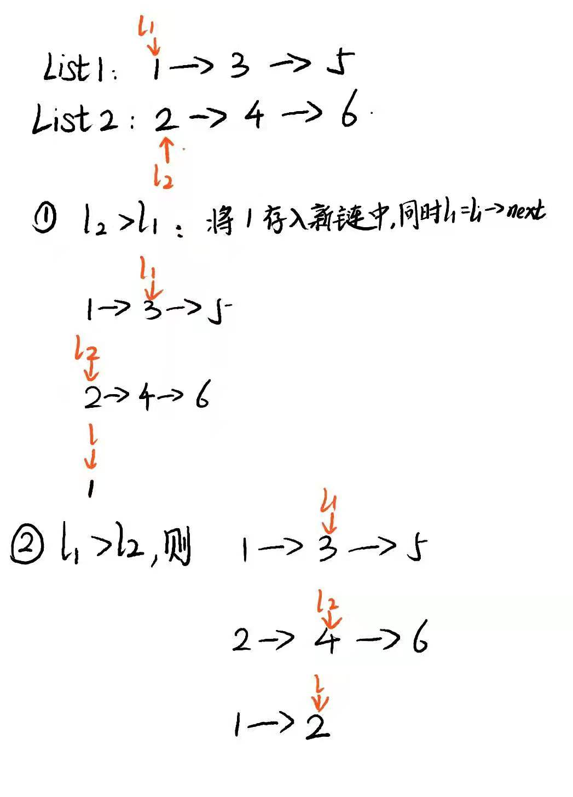

# 算法日记

---

## 链表

### leetcode234.回文链表

**问题**：请判断一个链表是否为回文链表。

> 思路：利用快慢指针，慢指针一次走一步，快指针一次走两步。对于奇数链表，当快指针走到尾节点的时候，慢指针走到中间节点；对于偶数链表，当快指针走到倒数第二个节点的时候，慢指针走到前半段的尾节点处。同时，在慢指针走的时候讲前半段链表反转。（如果是奇数链表，慢指针再走一步，因为中间节点不需要比较）然后比较前半段反转的链表和后半段链表即可。

**代码实现**

```js
/**
 * Definition for singly-linked list.
 * function ListNode(val, next) {
 *     this.val = (val===undefined ? 0 : val)
 *     this.next = (next===undefined ? null : next)
 * }
 */
/**
 * @param {ListNode} head
 * @return {boolean}
 */
var isPalindrome = function (head) {
  let slow = head;
  let pre = null;
  let reverse = null;
  while (head && head.next) {
    pre = slow;
    slow = slow.next;
    head = head.next.next;
    /* 反转前半链表 */
    pre.next = reverse;
    reverse = pre;
  }
  if (head) slow = slow.next;
  while (slow) {
    if (slow.val === pre.val) {
      slow = slow.next;
      pre = pre.next;
    } else return false;
  }
  return true;
};
```

### 剑指 24.反转链表

> 思路：利用前中后 3 个指针，边遍历边反转。

**代码实现:**

```js
/**
 * Definition for singly-linked list.
 * function ListNode(val) {
 *     this.val = val;
 *     this.next = null;
 * }
 */
/**
 * @param {ListNode} head
 * @return {ListNode}
 */
var reverseList = function (head) {
  let pre = null;
  let current = head;
  if (!head) return head;
  let ahead = head.next;
  while (current) {
    current.next = pre;
    pre = current;
    current = ahead;
    if (ahead) {
      ahead = ahead.next;
    }
  }
  return pre;
};
```

### leetcode21.合并两顺序表

> 思路：主要思路如下图。这里我第一次出错的原因是循坏条件判断错误，我用的是`l1||l2`，企图想一次性把所有条件都写在一起，这样的话`l1.val`可能为空，则出错。第 2 次的话，是遍历的错误，我写成了`l=l1` / `l=l2` ，这样的话 l 根本就没有 next，整个链表就支零破碎了。



**代码实现：**

```js
/**
 * Definition for singly-linked list.
 * function ListNode(val, next) {
 *     this.val = (val===undefined ? 0 : val)
 *     this.next = (next===undefined ? null : next)
 * }
 */
/**
 * @param {ListNode} l1
 * @param {ListNode} l2
 * @return {ListNode}
 */
var mergeTwoLists = function (l1, l2) {
  if (l1 === null) return l2;
  if (l2 === null) return l1;
  let head = new ListNode(-1);
  let l = head;
  while (l1 != null && l2 != null) {
    if (l1.val > l2.val) {
      l.next = l2;
      l2 = l2.next;
    } else {
      l.next = l1;
      l1 = l1.next;
    }
    l = l.next;
  }
  if (l1 === null) l.next = l2;
  if (l2 === null) l.next = l1;
  return head.next;
};
```

## 字符串

### leetcode125. 验证回文串

**问题**：给定一个字符串，验证它是否是回文串，只考虑字母和数字字符，可以忽略字母的大小写。

> 思路：首先我们把字母都转成小写，利用正则来选取字母与数字，再合并成一个新的字符串。然后我们利用双指针，从头尾同时朝着中间遍历，进行比较。

**代码实现：**

```js
/**
 * @param {string} s
 * @return {boolean}
 */
var isPalindrome = function (s) {
  let arr = s.toLowerCase().match(/[a-z0-9]+/g);
  if (!arr) return true;
  let str = arr.join("");
  let head = 0;
  let tail = str.length - 1;
  while (tail > head) {
    if (str[head] === str[tail]) {
      head++;
      tail--;
    } else {
      return false;
    }
  }
  return true;
};
```

```

```
