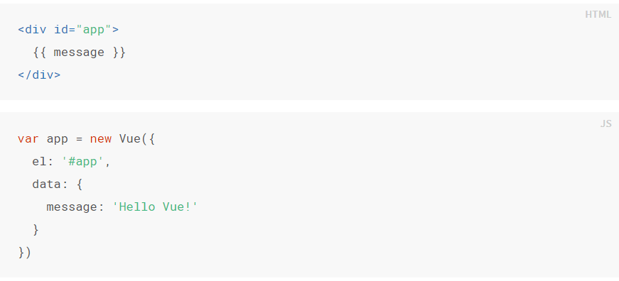
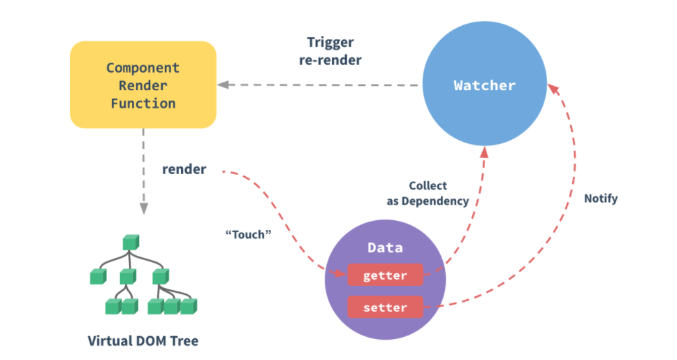

## Vue 2.\*

---

关于**Vue**，是一套用于构建用户界面的渐进式框架。简而言之，核心就是可以在不操作 dom 节点的基础下进行 dom 操作。

#### Vue 的声明式渲染以及简单原理介绍

---

**1.声明式渲染**

这里通过创建一个 Vue 实例,el 是声明 Vue 所渲染的元素节点(地盘)，在 Vue 地盘中，我们可以使用变量(为了不混淆我们把它成为状态),此时状态在 data 属性中进行声明。若不声明，则会报错。声明后可以通过 app.message 对状态进行修改，**所有的响应式变化都将会反映在页面上**

**2.简单的底层原理**
通过原生 JS 中的`Object.defineProperty()`方法，对所有的 Vue 状态进行监听与拦截。


#### Vue 的模板语法

---

**1.基本指令**
Vue 中所有的指令后面的值可以是变量或者*表达式*

- `v-show` 表示显示或者隐藏，后面的值为**boolean**值
- `v-if` 表示元素的创建或者删除,后面的值为**boolean**值
- `v-bind`**动态绑定(声明 Vue 地盘)**，后面绑定 dom 节点行内属性,值为变量或者表达式
  **如：**

```html
<div v-bind:class="isActive?'red':'yellow'">切换背景色</div>
```

```javascript
data: {
        isActive: true,
      },
```

**简写：**

```html
<div :class="isActive?'red':'yellow'">切换背景色</div>
```

- `v-on` **绑定事件**
  **如：**

```html
<div v-on:click="handleClick()">click</div>
```

```javascript
methods: {
        handleClick(){
            console.log('click me')
        }
      },
```

**简写：**

```html
<div @click="handleClick()">click</div>
```

这里注意，所有的函数方法都应该放在 Vue 的 methods 属性中。_【注】要是在表达式中没有括号，则可以直接在声明中传入形参获取事件对象；若加入括号，则可以直接在表达式中传入`$event`来获取事件对象_

- `v-for`**循环指令**

```html
<li v-for="(item,index) in dataList">{{item}}</li>
```

这里类比原生 JS 的方法，通过 for-in 或者 for-of 来遍历对象或者数组。

- `v-model` 双向绑定指令
  **可以轻松实现表单输入和应用状态之间的双向绑定，一般用于有 value 属性的表单元素**

- `v-html` 解析 html 标签的指令
  **注意：永远不要在用户可以进行提交的内容中使用，容易导致 XSS、CSRF 攻击**

**2.条件渲染**
`v-if`与`v-else-if`、`v-else`的使用，使用方法类似于 js 中的 if-else 条件语法

_案例：做一个留言板~~_

**3.列表渲染**
Vue 中提供了 Key 值概念，用于跟踪每个节点的身份，从而重用和重排序现有元素(key 类似 id，唯一且不重复)。

> **底层原理**：根据对象或者数组创建虚拟 dom，key 值可以在虚拟 dom 之间对比的时候发挥遍历作用

关于数组的检测更新机制：只有在影响原数组的时候才可以触发更新。比如通过*pop*、_push_、_shift_、*splice*方法等，或者通过`Vue.set`方法来改变数组。

    【注意】Vue 不能通过索引改变数组的方式来渲染页面。

_案例：做一个模糊查询功能_

**4.Vue 的事件修饰符**
`.stop` 用于阻止事件冒泡
`.prevent` 用于阻止默认事件
`.self` 当事件源 target 为自己时，触发事件(避免了事件冒泡)
`.once` 只会触发一次事件
`.capture` 在捕获的时候触发事件
`.passive` 一般用于移动端，可以提升滑动的性能。_每次事件产生的时候，浏览器会自动查询是否有阻止默认行为的动作，加上 passive 后就是为了告诉浏览器，不用查询了，我没有阻止默认行为_

**按键修饰符**
`@keyup.enter=function()` 按回车键即可触发事件
类似的，Vue 还支持`.ctal`、`.enter.ctal`或者直接+Keycode,例如 `@keyup.65=function()` 按 a 键即可触发事件

**表单修饰符**
`.lazy` 在表单元素失去焦点的时候触发(类比 js 中 change 事件)
`.number` 格式化数字(变成 Number 类型)
`.trim` 去首位空格

**5.表单控件绑定**
`v-model`在使用过程中的对于个别表单元素的特性用法

###### 对于多选框，采用数组写法(一定要给每个元素加上 value 值)

```html
<!-- 多选框 -->
<input type="checkbox" v-model="checkGroup" value="vue" />vue
<input type="checkbox" v-model="checkGroup" value="jquery" />jquery
<input type="checkbox" v-model="checkGroup" value="react" />react
```

###### 对于单个选项框，可以绑定一个 boolean 值

###### 对于单选框，绑定 value 值

```html
<!-- 多选框 -->
<input type="radio" v-model="favor" value="vue" />vue
<input type="radio" v-model="favor" value="jquery" />jquery
<input type="radio" v-model="favor" value="react" />react
```

**6.计算方法**
当在 dom 节点中存在一大串逻辑模板的时候，会造成难以维护的问题
比如`<div>{{a.toUpperCase()+"bcdefg"}}</div>`
这时候我们可以使用 Vue 的**Computed**属性。用起来与**methods**中的函数类似，但是他们的区别在于：

> **Computed：注重结果，不加括号** 1.用于逻辑计算，防止模板过程，使用缓存(避免多次执行，优化性能) 2.监听拦截，依赖修改，必须有 return 返回值

例子：

```html
<div id="box">{{total}}</div>
```

```javascript
computed: {
    total() {
        return "sum=100";
     },
},
```

**7.Mixins 混入**

###### 一种分发 Vue 组件中可复用功能的非常灵活的方式

```javascript
let obj = {
  methods: {
    handleClick() {
      console.log("click");
    },
  },
  computed: {
    total() {
      return "sum=100";
    },
  },
};
let vm = new Vue({
  el: "#box",
  mixins: [obj],
});
```

_同名的优先级问题：内部优先级大于外部优先级_
