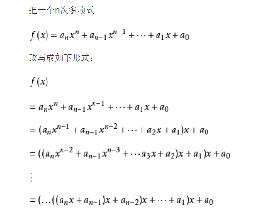

# javascript(ES6) 前端数据结构与算法

---

## Stack 栈结构

---

### 栈常见的操作

- `push()` 添加一个新元素到栈顶位置。
- `pop()` 移除栈顶的元素，同时返回被移除的元素。
- `peek()` 返回栈顶的元素，不对栈做任何修改（该方法不会移除栈顶的元素，仅仅返回它）。
- `isEmpty()` 如果栈里没有任何元素就返回 `true`，否则返回 `false`。
- `size()` 返回栈里的元素个数。这个方法和数组的 `length` 属性类似。
- `toString()` 将栈结构的内容以字符串的形式返回。

### JavaScript 实现栈结构

```js
class Stack {
  constructor() {
    this.items = [];
  }
  push(el) {
    this.items.push(el);
  }
  pop() {
    return this.items.pop();
  }
  peek() {
    if (this.items.length === 0) return null;
    return this.items[this.items.length - 1];
  }
  isEmpty() {
    return this.items.length === 0;
  }
  size() {
    return this.items.length;
  }
  toString() {
    let str = "";
    for (let i = 0; i < this.items.length; i++) {
      str += this.items[i];
    }
    return str;
  }
}
```

### 利用栈结构实现 十进制变成二进制

---

```js
function toBinary(num) {
  let stack = new Stack();
  while (num > 0) {
    stack.push(num % 2);
    num = Math.floor(num / 2);
  }
  let res = "";
  while (!stack.isEmpty()) {
    res += stack.pop();
  }
  return res;
}
```

## Queue 队列

---

### 队列常见的操作

- `enqueue(element)` 向队列尾部添加一个（或多个）新的项。
- `dequeue()` 移除队列的第一（即排在队列最前面的）项，并返回被移除的元素。
- `front()` 返回队列中的第一个元素——最先被添加，也将是最先被移除的元素。队列不做任何变动（不移除元素，只返回元素信息与 Map 类的 peek 方法非常类似）。
- `isEmpty()` 如果队列中不包含任何元素，返回 true，否则返回 false。
- `size()` 返回队列包含的元素个数，与数组的 length 属性类似。
- `toString()` 将队列中的内容，转成字符串形式。

### JavaScript 实现队列

---

```js
class Queue {
  constructor() {
    this.items = [];
  }
  enqueue(el) {
    this.items.push(el);
  }
  dequeue() {
    return this.items.shift();
  }
  front() {
    if (this.items.length === 0) return null;
    return this.items[0];
  }
  isEmpty() {
    return this.items.length === 0;
  }
  size() {
    return this.items.length;
  }
  toString() {
    let str = "";
    for (let i = 0; i < this.items.length; i++) {
      str += this.items[i];
    }
    return str;
  }
}
```

### 队列的应用

使用队列实现小游戏：**击鼓传花**。

?> 分析：传入一组数据集合和设定的数字 number，循环遍历数组内元素，遍历到的元素为指定数字 number 时将该元素删除，直至数组剩下一个元素。

```js
function passGame(nameList, num) {
  let queue = new Queue();
  /* 先插入元素 */
  for (let i = 0; i < nameList.length; i++) {
    queue.enqueue(nameList[i]);
  }
  while (queue.size() > 1) {
    for (let i = 0; i < num - 1; i++) {
      /* 把队列头部的元素放在尾部，这样就算num大于队列长度也不会出错*/
      queue.enqueue(queue.dequeue());
    }
    queue.dequeue();
  }
  return queue.front();
}
```

### PriorityQueue 优先级队列

---

优先级队列主要考虑的问题：

- 每个元素不再只是一个数据，还包含优先级。
- 在添加元素过程中，根据优先级放入到正确位置。

```js
// 优先队列内部的元素类
class QueueElement {
  constructor(element, priority) {
    this.element = element;
    this.priority = priority;
  }
}

// 优先队列类（继承 Queue 类）
export class PriorityQueue extends Queue {
  constructor() {
    super();
  }

  // enqueue(element, priority) 入队，将元素按优先级加入到队列中
  // 重写 enqueue()
  enqueue(el, priority) {
    // 根据传入的元素，创建 QueueElement 对象
    const queueElement = new QueueElement(el, priority);
    if (this.isEmpty()) this.items.push(queueElement);
    else {
      let added = false;
      /* 优先级越小越高 */
      for (let i = 0; i < this.size(); i++) {
        if (this.items[i].priority > queueElement.priority) {
          this.items.splice(i, 0, queueElement);
          added = true;
          break;
        }
      }
      if (!added) {
        this.items.push(queueElement);
      }
    }
  }

  // dequeue() 出队，从队列中删除前端元素，返回删除的元素
  // 继承 Queue 类的 dequeue()
  dequeue() {
    return super.dequeue();
  }

  // front() 查看队列的前端元素
  // 继承 Queue 类的 front()
  front() {
    return super.front();
  }

  // isEmpty() 查看队列是否为空
  // 继承 Queue 类的 isEmpty()
  isEmpty() {
    return super.isEmpty();
  }

  // size() 查看队列中元素的个数
  // 继承 Queue 类的 size()
  size() {
    return super.size();
  }

  // toString() 将队列中元素以字符串形式返回
  // 重写 toString()
  toString() {
    let result = "";
    for (let item of this.items) {
      result += item.element + "-" + item.priority + " ";
    }
    return result;
  }
}
```


## 链表

---

### 单向链表

> 单向链表是由一个一个节点链接而成的，链表只可以从 **head** 开始遍历。链表元素在内存中不必是连续的空间，因此可以实现内存动态管理；它的长度可以无限延申；插入以及删除元素的效率高

> **节点的封装**：

```js
class Node {
  constructor(data) {
    this.data = data;
    this.next = null;
  }
}
```

**单向链表的封装**:

```js
class LinkedList {
  constructor() {
    this.length = 0;
    this.head = null;
  }
  /* 方法 */
  append(data) {
    let newNode = new Node(data);
    if (!this.head) {
      this.head = newNode;
    } else {
      let current = this.head;
      while (current.next) {
        current = current.next;
      }
      current.next = newNode;
    }
    this.length++;
  }
  insert(position, data) {
    let newNode = new Node(data);
    if (position < 0 || position > this.length) return false;
    if (position === 0) {
      newNode.next = this.head;
      this.head = newNode;
    } else {
      let index = 0;
      let current = this.head;
      let prev = null;
      while (index++ < position) {
        prev = current;
        current = current.next;
      }
      newNode.next = current;
      prev.next = newNode;
    }
    this.length++;
    return true;
  }
  get(position) {
    let index = 0;
    let current = this.head;
    if (position < 0 || position > this.length - 1) return null;
    while (index++ < position) {
      current = current.next;
    }
    return current;
  }
  indexOf(data) {
    if (!this.head) return -1;
    let current = this.head;
    let index = 0;
    while (current) {
      if (current.data === data) {
        return index;
      }
      current = current.next;
      index++;
    }
    return -1;
  }
  removeAt(position) {
    if (position < 0 || position > this.length - 1) return null;
    let index = 0;
    let current = this.head;
    let prev = null;
    if (position === 0) {
      this.head = current.next;
    } else {
      while (index++ < position) {
        prev = current;
        current = current.next;
      }
      prev.next = current.next;
      current.next = null;
    }
    this.length--;
    return current.data;
  }
  update(position, data) {
    let res = this.removeAt(position);
    this.insert(position, data);
    return res;
  }
  remove(data) {
    const index = this.indexOf(data);
    if (index === -1) return;
    this.removeAt(index);
  }
  isEmpty() {
    return this.length === 0 ? true : false;
  }
  size() {
    return this.length;
  }
}
```

- `append()`: 在链表尾部插入节点。
- `insert()`：找到位置索引，引入当前节点和上一位节点，先将新节点指向当前节点，再断开上一位的链接，并指向新节点。
- `removeAt()`：找到位置索引，引入当前节点和上一位节点，先将上一位节点指向当前节点的后一位节点，再将当前节点指向 NULL，此时当前节点就断开了与链表的链接，会被自动清除内存空间。

### 双向链表

> 双向链表与单向链表最大的不同，就是每个节点还有一个 prev 指针，指向前一个节点。首节点的 prev 以及未节点的 next 为 null。链表除了 head 以外，还有一个 tail 指向尾节点

我们可以使用继承来实现双向链表的封装：

```js
class DoubleNode extends Node {
  constructor(data) {
    super(data);
    this.prev = null;
  }
}
```

```js
export class DoublyLinkedList extends LinkedList {
  constructor() {
    super();
    this.tail = null;
  }
}
```

然后让我们用 JavaScript 来实现双向链表的各种方法吧！

- `append` 添加元素

!> 这里要注意节点的 next 和 prev 的指向

```js
append(data) {
        const newNode = new DoubleNode(data)
        if (!this.head) {
            this.head = newNode
            this.tail = newNode
        } else {
            this.tail.next = newNode
            newNode.prev = this.tail
            this.tail = newNode
        }
        this.length++
    }
```

- `insert` 插入元素

!> 这里要注意插入节点的时候，前后两个节点的 next 和 prev 的指向

```js
insert(position, data) {
        if (position < 0 || position > this.length) return false
        const newNode = new DoubleNode(data)
        /* 特殊情况 */
        if (position === 0) {
          if(!this.head){
            this.head = newNode
            this.tail = newNode
          }else{
            this.head.prev = newNode
            newNode.next = this.head
            this.head = newNode
          }
        } else if (position === this.length) {
            this.tail.next = newNode
            newNode.prev = this.tail
            this.tail = newNode
        } else {
            let current = this.head
            let prevnode = null
            let index = 0
            while (index++ < position) {
                prevnode = current
                current = current.next
            }
            /* 这里注意有4个指针需要断开重连 */
            current.prev = newNode
            newNode.next = current
            newNode.prev = prevnode
            prevnode.next = newNode
        }
        this.length++
        return true
}
```

- `removeAt` 删除元素

```js
removeAt(position) {
        if (position < 0 || position > this.length - 1) return false
        if (position === 0) {
            if (this.length === 1) {
                this.head = null
                this.tail = null
            } else {
                this.head.next.prev = null
                this.head = this.head.next
            }
        } else if (position === this.length - 1) {
            this.tail = this.tail.prev
            this.tail.next = null
        } else {
            let index = 0
            let current = this.head
            let prevnode = null
            if (index++ < position) {
                prevnode = current
                current = current.next
            }
            prevnode.next = current.next
            current.next.prev = prevnode
            /* current.next = null
            current.prev = null */
        }
        this.length--
        return true
    }

```

- 顺序倒序输出字符串

```js
/*  链表数据从后往前以字符串形式返回 */
    backwardString() {
        let current = this.tail
        let str = ''
        while (current) {
            str += current.data + '---'
            current = current.prev
        }
        return str
    }
    /*  链表数据从前往后以字符串形式返回 */
    forwardToString() {
        let current = this.head
        let str = ''
        while (current) {
            str += current.data + '---'
            current = current.next
        }
        return str
    }
```

## 哈希表

---

哈希表是一种非常重要的数据结构，几乎所有的编程语言都直接或者间接应用这种数据结构。

哈希表通常是基于数组实现的，但是相对于数组，**它存在更多优势：**

- 哈希表可以提供非常快速的 插入-删除-查找 操作。
- 无论多少数据，插入和删除值都只需接近常量的时间，即 O(1) 的时间复杂度。实际上，只需要几个机器指令即可完成。
- 哈希表的速度比树还要快，基本可以瞬间查找到想要的元素。
- 哈希表相对于树来说编码要简单得多。

** 哈希表同样存在不足之处：**

- 哈希表中的数据是没有顺序的，所以不能以一种固定的方式（比如从小到大 ）来遍历其中的元素。
- 通常情况下，哈希表中的 key 是不允许重复的，不能放置相同的 key，用于保存不同的元素。

?> 哈希表的结构就是**数组**，但它神奇之处在于对下标值的一种变换，这种变换我们可以称之为**哈希函数**，通过哈希函数可以获取 **HashCode**。哈希表能够通过哈希函数把字符串转化为对应的下标值，建立字符串和下标值的映射关系。

### 哈希表的一些概念

- **哈希化**
  将大数字转化成数组范围内下标的过程，称之为哈希化。

- **哈希函数**
  我们通常会将单词转化成大数字，把大数字进行哈希化的代码实现放在一个函数中，该函数就称为哈希函数。

- **哈希表**
  对最终数据插入的数组进行整个结构的封装，得到的就是哈希表。

### 地址的冲突

在实际中，经过哈希函数哈希化过后得到的下标值可能有重复，这种情况称为**冲突**，冲突是不可避免的，我们只能解决冲突。

解决冲突常见的两种方案：**链地址法（拉链法）**和**开放地址法**。

#### 拉链法 (java 中的 HashMap)

> 链地址法解决冲突的办法是每个数组单元中存储的不再是单个数据，而是一条链条，这条链条常使用的数据结构为数组或链表，两种数据结构查找的效率相当（因为链条的元素一般不会太多）。


#### 开放地址法

> 开放地址法的主要工作方式是寻找空白的单元格来放置冲突的数据项。


探测空白单元格也有 3 种方式（他们主要是**步长不一样**）：

**线性探测**

- 当插入 13 时：

经过哈希化（对 10 取余）之后得到的下标值 index=3，但是该位置已经放置了数据 33。而线性探测就是从 index 位置+1 开始向后一个一个来查找合适的位置来放置 13，所谓合适的位置指的是空的位置，如上图中 index=4 的位置就是合适的位置。

- 当查询 13 时：

首先 13 经过哈希化得到 index=3，如果 index=3 的位置存放的数据与需要查询的数据 13 相同，就直接返回；
不相同时，则线性查找，从 index+1 位置开始一个一个位置地查找数据 13。
查询过程中不会遍历整个哈希表，只要查询到空位置，就停止，因为插入 13 时不会跳过空位置去插入其他位置。

- 当删除 13 时：

删除操作和上述两种情况类似，但需要注意的是，删除一个数据项时，不能将该位置下标的内容设置为 null，否则会影响到之后其他的查询操作，因为一遇到为 null 的位置就会停止查找。
通常删除一个位置的数据项时，我们可以将它进行特殊处理（比如设置为-1），这样在查找时遇到-1 就知道要继续查找。

线性探测最大的问题----就是**聚集**，为了解决这个问题，我们引入二次探测

**二次探测**

对步长进行了优化，比如从下标值 x 开始探测：x+1^2^、x+2^2^、x+3^3^ 。这样一次性探测比较长的距离，避免了数据聚集带来的影响。

**再哈希法**

把关键字用另一个哈希函数，再做一次哈希化，用这次哈希化的结果作为该关键字的步长。例如：

- `stepSize = constant - （key % constant）`；
  其中 constant 是质数，且小于数组的容量；
  例如：`stepSize = 5 - （key % 5）`，满足需求，并且结果不可能为 0；

### 哈希函数

哈希表的优势在于它的速度，所以哈希函数不能采用消耗性能较高的复杂算法。提高速度的一个方法是在哈希函数中尽量减少乘法和除法。

性能高的哈希函数应具备以下两个优点：

- 快速的计算；
- 均匀的分布；

霍纳法则：在中国霍纳法则也叫做秦久韶算法，这种算法是最优选。



这种算法是时间复杂度只有 O(n)。下面我们来实现一个简单的哈希函数:

```js
function hashFn(str, limit) {
  const prime = 11; //自己定义一个质数
  let hashCode = 0;
  /* 秦久韶算法 */
  for (let i = 0; i < str.length; i++) {
    hashCode = hashCode * prime + str.charCodeAt(i);
  }
  return hashCode % limit;
}
```

### 哈希表的封装

```js
export class HashTable {
  constructor() {
    this.storage = [];
    this.count = 0; /* 存放的元素个数 */
    this.limit = 11; /* 哈希表长度 */
  }
  /* 哈希函数 */
  hashFn(str, limit) {
    const prime = 11; //自己定义一个质数
    let hashCode = 0;
    /* 秦久韶算法 */
    for (let i = 0; i < str.length; i++) {
      hashCode = hashCode * prime + str.charCodeAt(i);
    }
    return hashCode % limit;
  }
}
```

接下来我们来实现一些哈希表的方法：

- **放入/修改**

> 主要思想：先获取 hashCode；然后判断该下标下 bucket 有无存值，无则创建，有则遍历该 bucket；判断是否有重复的 key，有则修改；若没有重复的 key，则直接 push [key,value] ; 最后长度增加

```js
/* 放入元素（修改） */
  put(key, value) {
    const index = this.hashFn(key, this.limit);
    let bucket = this.storage[index];
    /* 不存在就创建 */
    if (bucket === undefined) {
      bucket = [];
      this.storage[index] = bucket;
    }
    let isChange = false;
    for (let i = 0; i < bucket.length; i++) {
      let tuple = bucket[i];
      if (tuple[0] === key) {
        tuple[1] = value;
        isChange = true;
      }
    }
    if (!isChange) {
      bucket.push([key, value]);
      this.count++;
    }
  }
```
