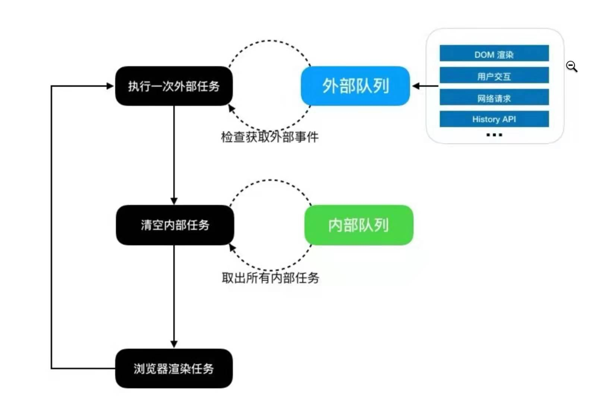
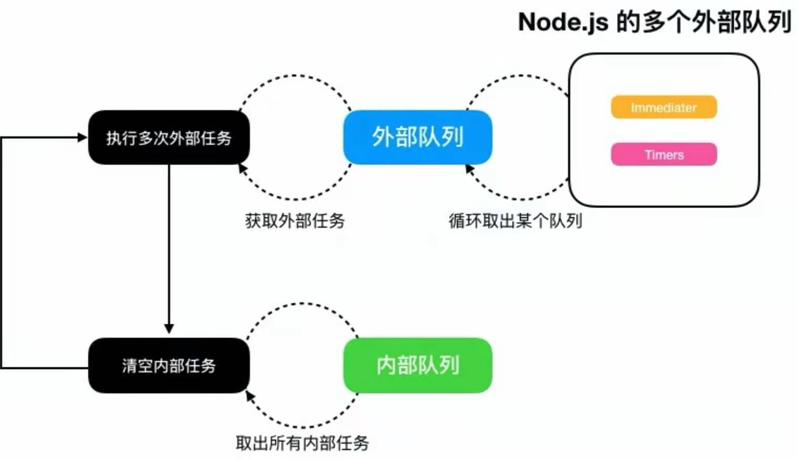

## Event Loop 事件循环机制

---

在网上，有很多文章都讨论过时间循坏，包括有一些前端面试题中也有涉及。因此我很好奇的去看了各种文章，写下这篇随笔来记录下我的思考。

### 浏览器的事件循环

首先，在 JavaScript 早期设计的目标是为了验证用户提交的表单数据的，那么有以下场景：用户打开一个网页并填写好了表单，然后提交。那么我们可以发现，早期 JavaScript 的执行是例如用户点击表单提交的时候，触发的 DOM 的点击事件，而该事件绑定了对应的回调函数，即这个 JavaScript 代码是被动调用的。

其实，事件循坏本质上就是 user agent，JavaScript 脚本，渲染以及网络等行为的一个机制

我们经常能遇到一些网上的 JavaScript 的题：

```js
console.log(1);
setTimeout(() => {
  console.log(2);
}, 0);
new Promise((r, j) => {
  console.log("new Promise");
  r();
}).then(() => {
  console.log("then");
});
console.log(3);
```

像这种情况，各种事件同时触发的时候，肯定有一个先来后到的排队问题，这就是事件循环所要解决的东西。我们都知道，JavaScript 是单线程语言。但在 ES6 中，JavaScript 也拥有了同步事件以及异步事件(如 Promise)。那么，在 JavaScript 的事件执行队列中，主要分成 2 个队列：

- 外部队列 **Task Queue** , 也称为宏任务**macrotask**,包括`script`，`setTimeout`、`setInterval`、`UI rendering`、`setImmediate`。
- 内部队列，即微任务**Microtask Queue**,如`Promise中的then和catch`，Mutation Observer 等。



1. **从外部队列取出一个可执行任务，无则跳过**
2. **依次执行所有微任务**
3. **UI rendering**
4. **循坏回第一步**

根据这样的规则，上述的题我们可以得出结论：

```
1
new Promise
3
2
then
```

当然 上述规则是浏览器正常的事件循环机制。

### Node.js 的事件循环差异

Node(服务器端)与浏览器面对的场景有着很大的差异：

1. 没有 HTML 渲染的过程，只剩下了宏任务以及微任务。
2. 宏任务的事件源没有了鼠标等外设事件，但拥有了文件等 IO。
3. **微任务就只剩下 Promise 的 then 和 catch**

我们可以通过以下例子来看看 Node 和浏览器的区别：

```js
setTimeout(() => {
  console.log("timer1");
  Promise.resolve().then(function () {
    console.log("promise1");
  });
});

setTimeout(() => {
  console.log("timer2");
  Promise.resolve().then(function () {
    console.log("promise2");
  });
});
```

我们可以知道，浏览器中的事件执行顺序如下：

```js
timer1;
promise1;
timer2;
promise2;
```

但在 Node 中，执行顺序如下：

```js
timer1;
timer2;
promise1;
promise2;
```

因此我们可以知道，Node 中与浏览器端最大的区别，**就是浏览器中一次事件循环只执行一个宏任务，但 Node 中是依次执行一个外部队列中全部的任务。**

我们可以再看一个例子：

```js
setTimeout(() => {
  console.log("setTimeout1");
  Promise.resolve().then(() => console.log("promise1"));
});

setTimeout(() => {
  console.log("setTimeout2");
  Promise.resolve().then(() => console.log("promise2"));
});

setImmediate(() => {
  console.log("setImmediate1");
  Promise.resolve().then(() => console.log("promise3"));
});

setImmediate(() => {
  console.log("setImmediate2");
  Promise.resolve().then(() => console.log("promise4"));
});
```

结果是：

```js
setImmediate1;
setImmediate2;
promise3;
promise4;
setTimeout1;
setTimeout2;
promise1;
promise2;
```

**即`setImmediate`和`setTimeout`是处于 2 个外部队列中的，只有执行完`setImmediate`的队列，才会执行`setTimeout`**


