# 这个栏目用来记录我学习网络知识的复盘和随笔

# Get 和 Post

在学习 JavaWeb 知识的时候已经遇见过很多`doget`、`dopost`方法了，那么什么是`Get`和`Post`呢？，今天才了解到**内幕**。

- Get 方法

`Get`⽅法的含义是请求从**服务器获取资源**，这个资源可以是静态的⽂本、⻚⾯、图⽚视频等。

> 举个栗子，你打开网站，网站返回你所需要的数据，get！

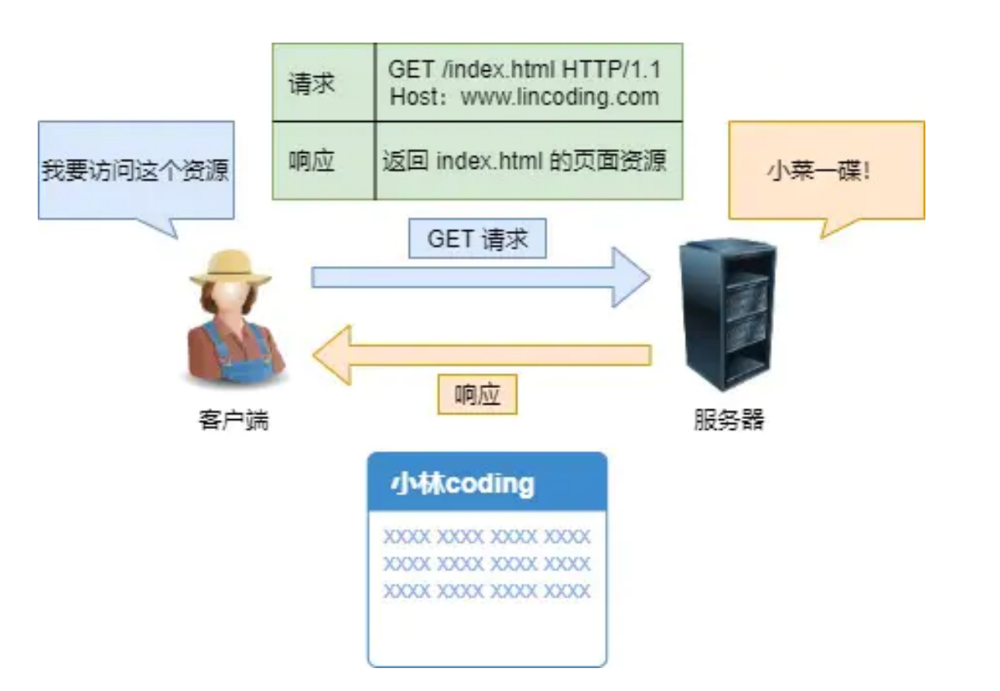

Get 请求的过程涉及到:

1、当浏览器(客户端)向服务器**发送请求时**，浏览器会把 http header 和 data 一并发送出去，

2、当服务器接收到这些服务器请求数据时，**响应 200（返回数据）**。

3、浏览器发送的数据对服务器进行了**读**操作

在这个过程中，浏览器(客户端)仅仅产生了**一次**TCP 数据报

- Post 方法

`POST`⽅法则是相反操作，它向**URI 指定的资源提交数据**，数据就放在报⽂的 body ⾥。

> 再举个栗子，你在朋友圈里评论了，浏览器就会执⾏⼀次 POST 请求，把你的
> 评论⽂字放进了报⽂ body ⾥，然后拼接好 POST 请求头，通过 TCP 协议发送给服务器。

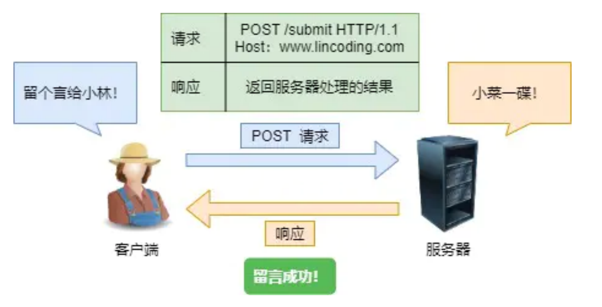

Post 请求的过程涉及到:

1、浏览器先发送 header，服务器响应 100 continue，

2、浏览器再发送 data，服务器响应**200（返回数据**）。

3、浏览器发送的数据对服务器进行了**写**操作，即修改了服务器的内容(可以这么讲吧？)。

这个过程中，浏览器(客户端)产生了**两次**TCP 数据报。

`Get`和`Post`区别：

- `Get`请求只产生一次 TCP 数据报

  `Post`请求产生两次 TCP 数据报

- 在网络条件好的情况下，`Get`和`Post`请求速度差不多(但是 Get 理论上还是快一点)

  在网络条件不好的情况下，发送**两次**TCP 数据报的`Post`请求对**验证数据包的完整性**有更大的优点。

- W3C 规定，`Get`是往客户端向服务器获取数据的(Get 也能向服务器发送数据，但是不建议这么做)，

`Post`是客户端往服务器提交数据(涉及到了一个安全的问题).

图片引用自:小林 coding 里的《图解网络》

# HTTP 特征

## 优点

- **简单**

HTTP 基本的报文格式就是`header + body`，头部信息也是`key-value`

- **灵活、易于扩展**

HTTP 组成要求没有被固定，允许开发人员`自定义扩展`

HTTP 在 OSI 的第七层(应用层)，`下层可以随意变化`，如**HTTP3**和**HTTPs**

- **应用广泛且跨平台**

互联网发展至今，HTTP 的应用范围非常的广泛， ，同时天然具有**跨平台**的优越性

## 缺点

- **无状态请求**

  - 无状态的好处，因为服务器不会去记忆 HTTP 的状态，所以不需要额外的资源来记录状态信息，这能`减轻服务器的负担`

  - 无状态的坏处，既然服务器没有记忆能力，它在完成有`关联性`的操作时会非常麻烦
    - 其中解决`关联性`操作有 Cookie、Session 等方法

- **明文传输**

  - 好处在于可以通过**抓包软件**和**控制台**来对工作进行调试

  - 坏处在于明文传输就类似于**信息裸奔**，信息容易遭受到攻击和替换

- **不安全**

  - 传输的内容可能遭到窃听(**信息泄露**)

  - 传输的内容可能遭到更改和替换(**假的网站链接、网站的垃圾推送广告**等)

后面讲到的 HTTPs 协议也是为了解决 HTTP 原生的安全问题

## 性能

### HTTP/1.1

HTTP 协议是基于**TCP/IP**，并且使用了`请求 - 应答`的通信模式

HTTP1.0 性能较为一般，每一次请求都会伴随`连接和断开`的操作(三次握手)

> 故 HTTP1.1 采用了以下方法来优化性能:

- **长连接，也叫持久连接**
  - 减少了 TCP 连接的重复建立

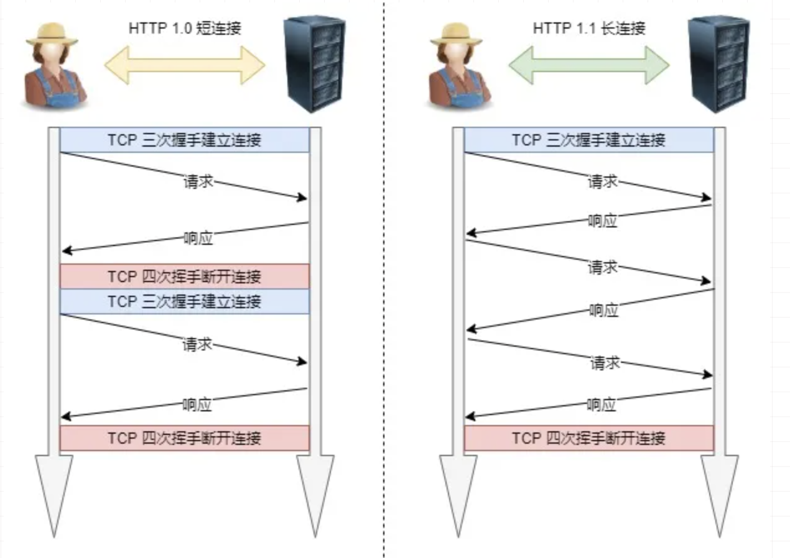

- **管道网络传输**

在同一个 TCP 连接里面，客户端可以发起多个请求，只要第一个请求发出去了，不必等其回来，就可以发第二个请求出去，可以减少整体的响应时间。

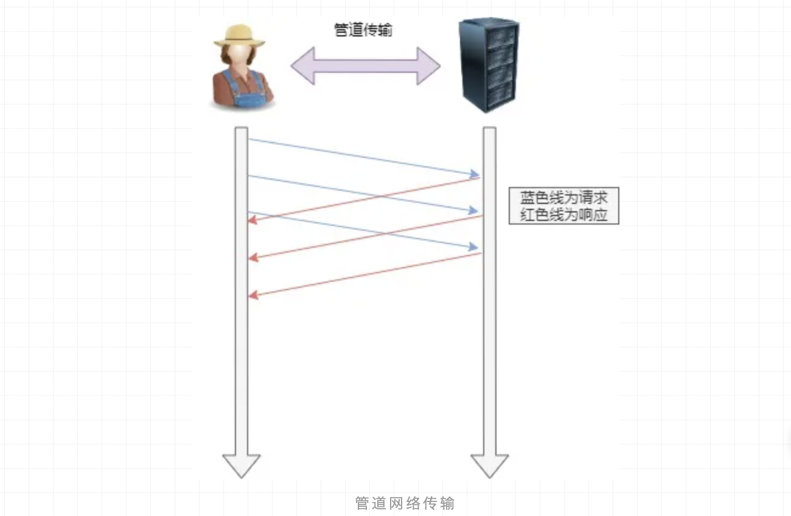

> 性能瓶颈

- **请求 / 响应头部（Header）未经压缩就发送**，首部信息越多延迟越大。只能压缩 Body 的部分

- 发送冗长的首部。每次互相发送相同的首部造成的浪费较多

- 服务器是按请求的顺序响应的，如果服务器响应慢，会招致客户端一直请求不到数据，也就是**队头阻塞**
  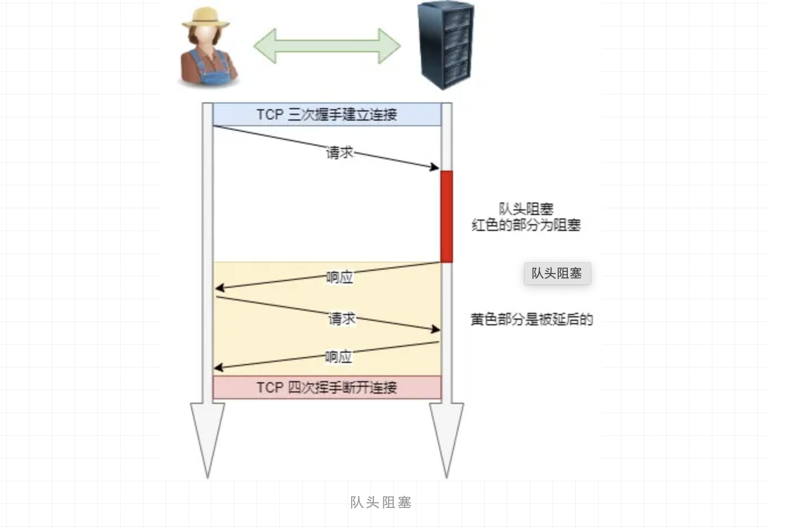

- 没有请求优先级控制

- 请求只能从客户端开始，服务器只能被动响应

### HTTP/2

> HTTP/2 较 HTTP/1.1 做了性能上的改进

- 头部压缩

HTTP/2 会**压缩头**(Header)如果你同时发出多个请求，他们的头是一样的或是相似的，那么，协议会帮你消除重复的部分。

这就是所谓的`HPACK算法`：在客户端和服务器同时维护一张**头信息表**，所有字段都会存入这个表，生成一个索引号，以后就不发送同样字段了，只发送索引号，这样就提高速度了。

- 二进制格式

HTTP/2 不再像 HTTP/1.1 里的纯文本形式的报文，而是全面采用了`二进制格式`。

头信息和数据体都是二进制，并且统称为帧（frame）：`头信息帧和数据帧`

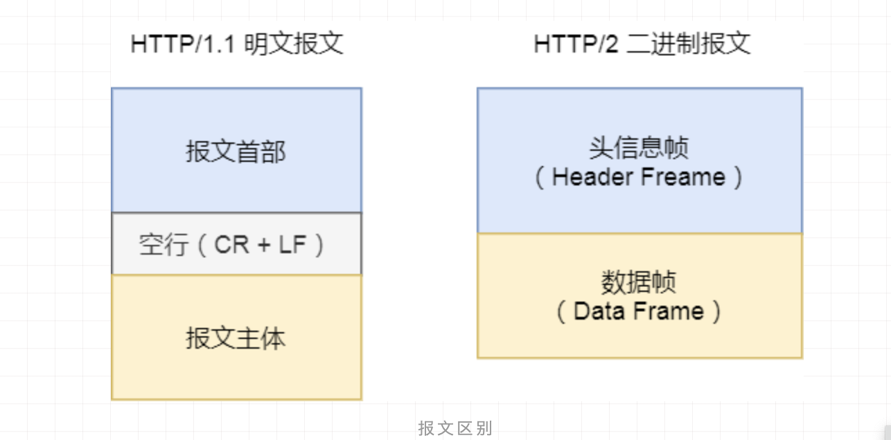

因为计算机只懂二进制，那么收到报文后，无需再将明文的报文转成二进制，而是直接解析二进制报文，这**增加了数据传输的效率**。

- 数据流

HTTP/2 的数据包不是按顺序发送的，同一个连接里面连续的数据包，可能属于不同的回应。因此，必须要对数据包做标记，指出它属于哪个回应。

每个请求或回应的所有数据包，称为一个`数据流`（Stream）。

每个数据流都标记着一个独一无二的编号，其中规定客户端发出的数据流编号为奇数， 服务器发出的数据流编号为偶数

客户端还可以指定数据流的**优先级**。优先级高的请求，服务器就先响应该请求

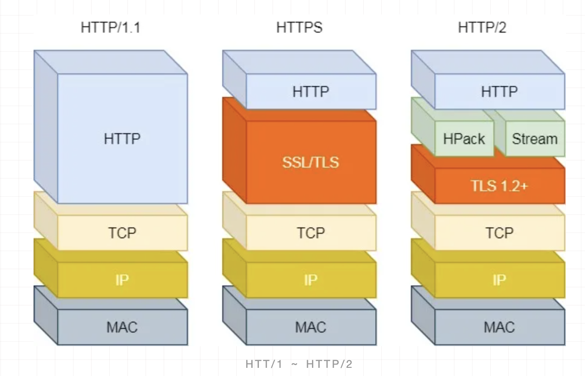

- 多路复用

HTTP/2 是可以在一个连接中**并发多个请求或回应，而不用按照顺序一一对应**

移除了 HTTP/1.1 中的串行请求，不需要排队等待，也就不会再出现「队头阻塞」问题，降低了延迟，大幅度提高了连接的利用率

举例来说，在一个 TCP 连接里，服务器收到了客户端 A 和 B 的两个请求，如果发现 A 处理过程非常耗时，于是就回应 A 请求已经处理好的部分，接着回应 B 请求，完成后，再回应 A 请求剩下的部分。

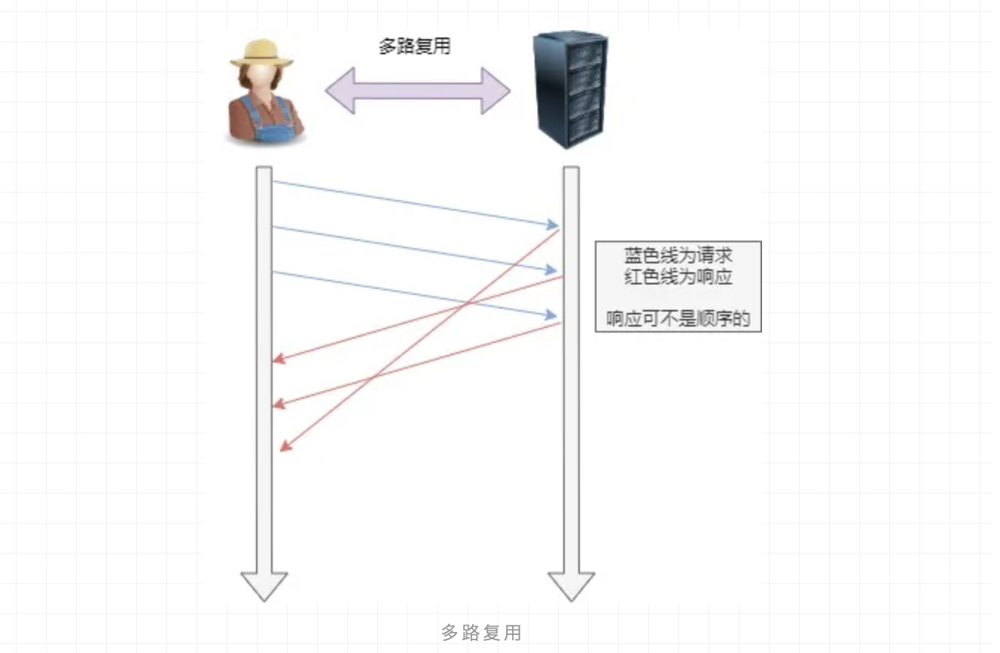

- 服务器推送

HTTP/2 还在一定程度上改善了传统的「请求 - 应答」工作模式，服务不再是被动地响应，也可以**主动**向客户端发送消息。

举例来说，在浏览器刚请求 HTML 的时候，就提前把可能会用到的 JS、CSS 文件等静态资源主动发给客户端，减少**延时的等待**，也就是服务器推送（Server Push，也叫 Cache Push）。

> 性能瓶颈

- HTTP/2 主要的问题在于：多个 HTTP 请求在复用一个 TCP 连接，下层的 TCP 协议是不知道有多少个 HTTP 请求的。

所以一旦发生了丢包现象，就会触发 TCP 的重传机制，这样在一个 TCP 连接中的**所有的 HTTP 请求都必须等待这个丢了的包被重传回来**。

!> HTTP/1.1 中的**管道（ pipeline）传输**中如果有一个请求阻塞了，那么队列后请求也统统被阻塞住了

!> HTTP/2 **多路请求复用**一个 TCP 连接，一旦发生丢包，就会阻塞住所有的 HTTP 请求。

### HTTP/3

> 性能优化

针对 HTTP/2 的问题，都是基于 TCP 传输层的问题，所以 HTTP/3 把 HTTP 下层的 TCP 协议改成了 UDP

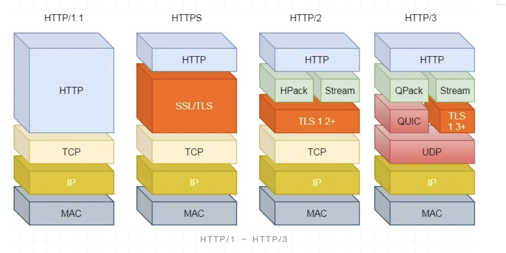

UDP 发生是不管顺序，也不管丢包的，所以不会出现 HTTP/1.1 的**队头阻塞**和 HTTP/2 的**一个丢包全部重传**问题。

大家都知道 UDP 是不可靠传输的，但基于 UDP 的`QUIC协议`可以实现类似 TCP 的可靠性传输。

- QUIC 有自己的一套机制可以保证传输的可靠性的。当某个流发生丢包时，只会阻塞这个流，**其他流不会受到影响**。

- TL3 升级成了最新的**1.3**版本，头部压缩算法也升级成了**QPack**

- HTTPS 要建立一个连接，要花费 6 次交互，先是建立三次握手，然后是**TLS/1.3**的三次握手。QUIC 直接把以往的 TCP 和**TLS/1.3**的**6 次交互合并成了 3 次**，减少了交互次数。

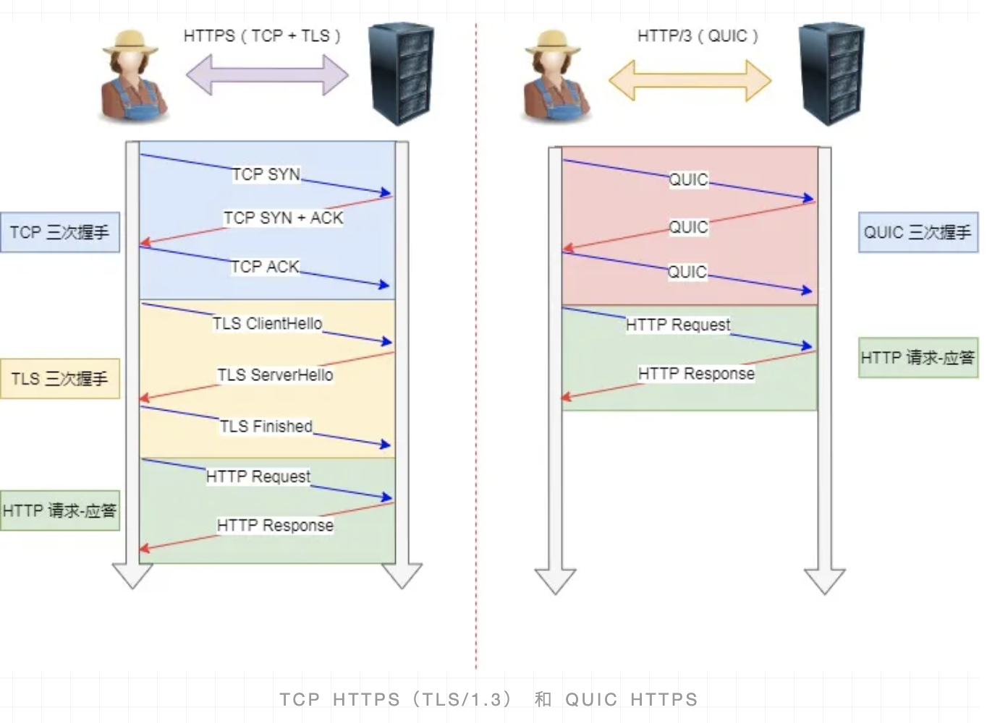

所以， QUIC 是一个在 UDP 之上的**伪 TCP+TLS+HTTP/2**的多路复用的协议。

QUIC 是新协议，对于很多网络设备，根本不知道什么是 QUIC，只会当做 UDP，这样会出现新的问题。所以 HTTP/3 现在普及的进度非常的缓慢，不知道未来 UDP 是否能够逆袭 TCP。

## TCP 为什么是三次握手

---

首先得先了解 TCP 是怎么保证建立一个可靠链接的。在**RFC**中我们可以知道，TCP 利用序列号(sequence number)来达成可靠连接的。而三次握手，是达成该要求的最低理论次数。

**TCP 可靠链接的精髓**：

- 客户端 A 首先发送一个链接请求报文字段，包括了表示同步的 SYN 和自己的初始序列号(Initial sequence number)，比如，A 说自己的初始序列号是 100，则相当于告诉 B 做好心里准备，将要接受到的数据编号是从 101 开始，101、102......，B 可以对数据编号进行判断是否合法，也可以确认数据到达了多少。
- 第二次握手则是由 B 发起的：B 会将从 A 收到的 ISN 记录为 ACK ，并且把它以及 B 的 ISN 和 SYN 一起返回给 A。

!> SYN 是可以判断链接是否是超时的链接

- 第三次握手：客户端收到连接同意的回响时，还要通知服务端，表示回应已收到，可以建立链接。
  此时改请求报文有：ACK ，seq 。

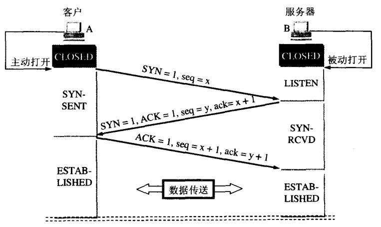

!> 失效的连接请求：若客户端向服务端发送的连接请求丢失，客户端等待应答超时后就会再次发送连接请求，此时，上一个连接请求就是『失效的』。

## HTTP 状态码

---

- `1xx` 表示 continue，一般用户不会看到，由浏览器内部进行解决
- `2xx` 表示请求成功，也是我们最喜欢的一个状态码
- `3xx` 表示客户端需要进行某些操作
  - `301` 表示资源永久性转移，一般代表错误
  - `302` 表示资源暂时性转移
  - `304` 表示客户端浏览器缓存问题
- `4xx` 表示请求错误
  - `400` 表示请求发送的数据格式、或者请求报文错误 Bad Request
  - `401/403` 表示客户端没有权限
  - `404` 表示网页不存在
- `5xx` 表示服务端错误
  - `500` 表示服务端错误
  - `503` 表示服务器繁忙
