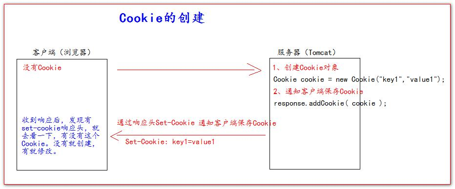
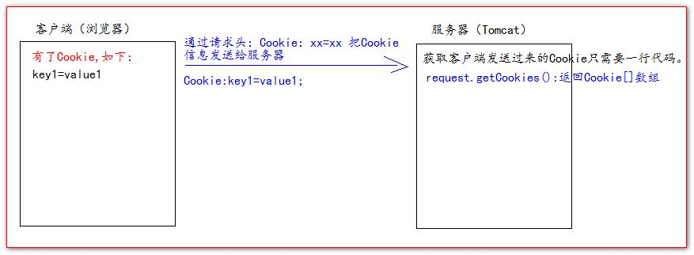
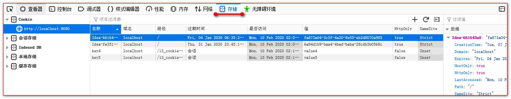
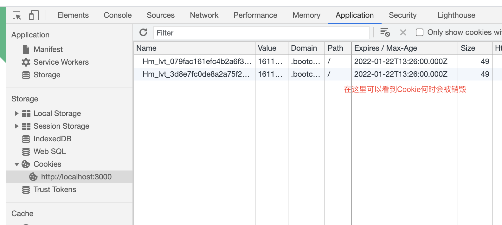
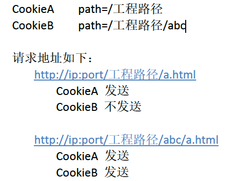
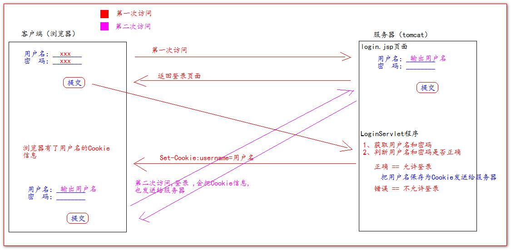
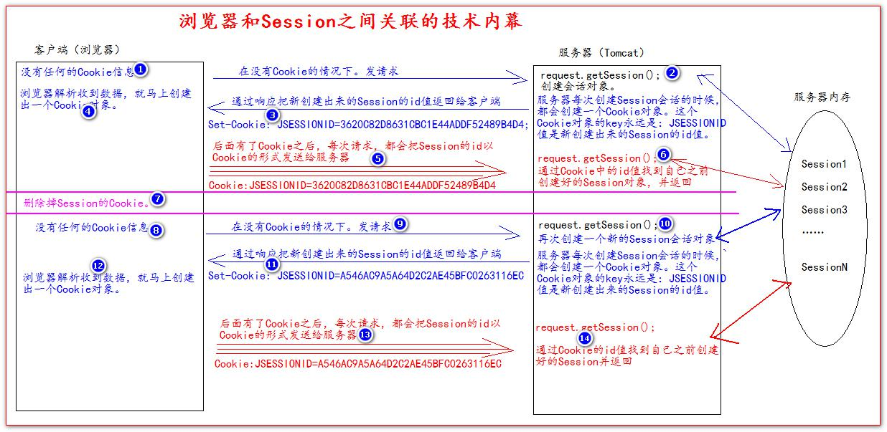

## Cookie

### 什么是 Cookie?

- Cookie 翻译过来是饼干的意思。
- Cookie 是服务器通知客户端保存键值对的一种技术。
- 客户端有了 Cookie 后，每次请求都发送给服务器。
- 每个 Cookie 的大小不能超过 4kb

---

### 如何创建 Cookie

创建一个 Cookie 可以通过`respone.addcookie(cookie)`来创建

我们可以看看一个 Cookie 的创建过程如下:



---

### 服务器如何获取 Cookie

服务器获取客户端的 Cookie 只需要一行代码：`request.getCookies()`

其中`request.getCookies()`获取的是存储在客户端的 Cookie 数组，即是**全部**Cookie

其创建过程如下:



---

### Cookie 值的修改

- 方案一：

1、先创建一个要修改的同名（指的就是 key）的 Cookie 对象

2、在构造器，同时赋于**新的**Cookie 值。

```java
Cookie cookie = new Cookie("key1","newValue1");
```

3、调用`response.addCookie(Cookie)`;

- 方案二：

1、先查找到需要修改的 Cookie 对象

2、调用`setValue()`方法赋于新的 Cookie 值。

```java
cookie.setValue("newValue2");
```

3、调用`response.addCookie()`通知客户端保存修改

> 区别:

> - 方案一是创建一个新的同名 Cookie 来覆盖掉原来 Cookie

> - 方案二是直接修改需要修改的 Cookie 值

---

### 浏览器查看 Cookie

- 谷歌浏览器查看 Cookie


- 火狐浏览器查看 Cookie



---

### Cookie 的生命控制

- Cookie 的生命控制指的是如何管理 Cookie 什么时候被销毁（删除）

- 我们可以通过`setMaxAge()`来设置 Cookie 的生命控制

`setMaxAge(正数)`，表示在指定的秒数后过期

`setMaxAge(负数)`，表示浏览器一关，Cookie 就会被删除（默认值是-1）

`setMaxAge(0)`，表示马上删除 Cookie

- 其中，Cookie 的生命周期可以在浏览器里查看



---

### Cookie 有效路径 Path 的设置

- Cookie 的 path 属性可以有效的过滤哪些 Cookie 可以发送给服务器。哪些不发。
- path 属性是通过请求的地址来进行有效的过滤。

- `getContextPath()` ===>>>> 得到工程路径



- 代码如下:

```java
cookie.setPath( req.getContextPath() + "/abc" );
```

---

### Cookie 验证登录的一个简单流程



> ## Session 会话

---

### 什么是 Session 会话?

- Session 就一个接口（HttpSession）。
- Session 就是会话。它是用来维护一个客户端和服务器之间关联的一种技术。
- 每个客户端都有自己的一个 Session 会话。
- Session 会话中，我们经常用来保存用户登录之后的信息。

---

### 如何创建 Session 和获取(id 号,是否为新)

如何创建和获取 Session。它们的 API 是一样的。

- `request.getSession()`

第一次调用是：创建 Session 会话

之后调用都是：获取前面创建好的 Session 会话对象。（单例模式？）

- `isNew()`; 判断到底是不是刚创建出来的（新的）

**true**表示刚创建

**false**表示获取之前创建

- `getId()` 得到 Session 的会话 id 值。

每个会话都有一个身份证号。也就是 ID 值。而且这个 ID 是唯一的。

---

### Session 域数据的存取

`setAttribute()`设置当前 Session 的域数据

`getAttribute()`获取当前 Session 的域数据

```java
req.getSession().setAttribute("key1", "value1");
req.getSession().getAttribute("key1");
```

### Session 生命周期控制

- `session.setMaxInactiveInterval(int interval)`

设置 Session 的超时时间（以秒为单位），超过指定的时长，Session 就会被销毁。

值为**正数**的时候，设定 Session 的超时时长。

**负数**表示永不超时（极少使用）

- `getMaxInactiveInterval()`获取 Session 的超时时间
- `session.invalidate()` 让当前 Session 会话马上超时无效。

!>Session 默认的超时时间长为 30 分钟。

---

### 浏览器和 Session 关联的内幕

Session 技术，底层其实是基于 Cookie 技术来实现的。


