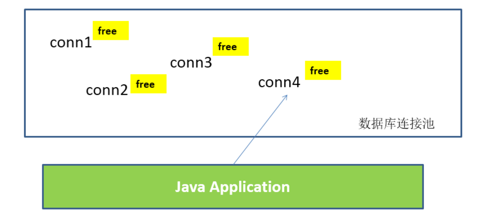

# JDBC

>这里记录我学习JDBC连接数据库操作时的一些难点和复盘，方便后续的复习

这里开始尝试对我学习笔记的子标题设计一个通用的模版:需求分析和实现

## 为什么需要JDBC


没有JDBC之前，程序员们操作不同数据库时，都是我们通过代码去实现的。

而连接MySQL的代码，和连接Oracle的代码是不同的；

这就导致了，我们**更换数据库时就要去修改代码**，代码的**可复用性**和**移植性**就显得很低了。

## 什么是JDBC

- JDBC(Java Database Connectivity)是一个独立于特定数据库管理系统、通用的SQL数据库存取和操作的**公共接口**（一组API），
定义了用来访问数据库的标准Java类库，（**java.sql,javax.sql**）使用这些类库可以以一种**标准**的方法、方便地访问数据库资源。

- JDBC为访问不同的数据库提供了一种**统一的途径**，为开发者屏蔽了一些细节问题。
  
- JDBC的目标是使Java程序员使用JDBC可以连接任何**提供了JDBC驱动程序**的数据库系统，这样就使得程序员无需对特定的数据库系统的特点有过多的了解，从而大大简化和加快了开发过程。

>说人话就是提供了一个**通用的接口**(**标准**)来**操作数据库**，在程序中加载的类都是**Java原生提供的类**，
并不包含外部引用的类，提高了代码的**可复用性**和**移植性**。


- JDBC接口（API）包括两个层次：
    - **面向应用的API**：Java API，抽象接口，供应用程序开发人员使用（连接数据库，执行SQL语句，获得结果）。
    -  **面向数据库的API**：Java Driver API，供开发商开发数据库驱动程序用。

> **JDBC是Sun公司(那时还没被Oracle收购)提供一套用于数据库操作的接口，java程序员只需要面向这套接口编程即可。**
>
> **不同的数据库厂商，需要针对这套接口，提供不同实现。不同的实现的集合，即为不同数据库的驱动。																————面向接口编程**


## JDBC的功能实现


步骤简单理解为就是:

- 连接数据库

- 执行sql语句

- 如果是**查询**则通过Result对象来接受**结果数据**(其中得提前创建接收**对应**数据的Java对象)

- 断开数据库连接

其中，
- 数据库的连接等由程序员使用**数据库连接池**完成

- 执行sql语句由程序员使用**JDBC工具类库实现CUDR操作**完成

当然，数据库的连接和断开以及CUDR操作可以自己写，但是这也存在一些弊端，下面会介绍道。


## 数据库连接池

### JDBC数据库连接池的必要性

- 在使用开发基于数据库的web程序时，传统的模式基本是按以下步骤：
  - **在主程序（如servlet、beans）中建立数据库连接**
  - **进行sql操作**
  - **断开数据库连接**

- 这种模式开发，存在的问题:
  - 普通的JDBC数据库连接使用 DriverManager 来获取，每次向数据库建立连接的时候都要将 Connection 加载到内存中，再验证用户名和密码(得花费0.05s～1s的时间)。需要数据库连接的时候，就向数据库要求一个，执行完成后再断开连接。这样的方式将会消耗大量的资源和时间。**数据库的连接资源并没有得到很好的重复利用。**若同时有几百人甚至几千人在线，频繁的进行数据库连接操作将占用很多的系统资源，严重的甚至会造成服务器的崩溃。
  - **对于每一次数据库连接，使用完后都得断开。**否则，如果程序出现异常而未能关闭，将会导致数据库系统中的内存泄漏，最终将导致重启数据库。（回忆：何为Java的内存泄漏？）
  - **这种开发不能控制被创建的连接对象数**，系统资源会被毫无顾及的分配出去，如连接过多，也可能导致内存泄漏，服务器崩溃。

### 数据库连接池技术

- 为解决传统开发中的数据库连接问题，可以采用数据库连接池技术。
  
- **数据库连接池的基本思想**：就是为数据库连接建立一个“缓冲池”。预先在缓冲池中放入一定数量的连接，当需要建立数据库连接时，只需从“缓冲池”中取出一个，使用完毕之后再放回去。

- **数据库连接池**负责分配、管理和释放数据库连接，它**允许应用程序重复使用一个现有的数据库连接，而不是重新建立一个**。

- 数据库连接池在初始化时将创建一定数量的数据库连接放到连接池中，这些数据库连接的数量是由**最小数据库连接数来设定**的。无论这些数据库连接是否被使用，连接池都将一直保证至少拥有这么多的连接数量。连接池的**最大数据库连接数量**限定了这个连接池能占有的最大连接数，当应用程序向连接池请求的连接数超过最大连接数量时，这些请求将被加入到等待队列中。
  

- **工作原理：**
  

- **数据库连接池技术的优点**

  **1. 资源重用**

  由于数据库连接得以重用，避免了频繁创建，释放连接引起的大量性能开销。在减少系统消耗的基础上，另一方面也增加了系统运行环境的平稳性。

  **2. 更快的系统反应速度**

  数据库连接池在初始化过程中，往往已经创建了若干数据库连接置于连接池中备用。此时连接的初始化工作均已完成。对于业务请求处理而言，直接利用现有可用连接，避免了数据库连接初始化和释放过程的时间开销，从而减少了系统的响应时间

  **3. 新的资源分配手段**

  对于多应用共享同一数据库的系统而言，可在应用层通过数据库连接池的配置，实现某一应用最大可用数据库连接数的限制，避免某一应用独占所有的数据库资源

  **4. 统一的连接管理，避免数据库连接泄漏**

  在较为完善的数据库连接池实现中，可根据预先的占用超时设定，强制回收被占用连接，从而避免了常规数据库连接操作中可能出现的资源泄露

### 多种开源的数据库连接池

- JDBC 的数据库连接池使用 javax.sql.DataSource 来表示，DataSource 只是一个接口，该接口通常由服务器(Weblogic, WebSphere, Tomcat)提供实现，也有一些开源组织提供实现：
  - **DBCP** 是Apache提供的数据库连接池。tomcat 服务器自带dbcp数据库连接池。**速度相对c3p0较快**，但因自身存在BUG，Hibernate3已不再提供支持。
  - **C3P0** 是一个开源组织提供的一个数据库连接池，**速度相对较慢，稳定性还可以。**hibernate官方推荐使用
  - **Proxool** 是sourceforge下的一个开源项目数据库连接池，有监控连接池状态的功能，**稳定性较c3p0差一点**
  - **BoneCP** 是一个开源组织提供的数据库连接池，速度快
  - **Druid** 是阿里提供的数据库连接池，据说是集DBCP 、C3P0 、Proxool 优点于一身的数据库连接池，但是速度不确定是否有BoneCP快

- DataSource 通常被称为数据源，它包含连接池和连接池管理两个部分，习惯上也经常把 DataSource 称为连接池

- **DataSource用来取代DriverManager来获取Connection，获取速度快，同时可以大幅度提高数据库访问速度。**

- 特别注意：
  - 数据源和数据库连接不同，数据源无需创建多个，它是产生数据库连接的工厂，因此**整个应用只需要一个数据源即可。**
  - 当数据库访问结束后，程序还是像以前一样关闭数据库连接：conn.close(); 但conn.close()并没有关闭数据库的物理连接，它仅仅把数据库连接释放，归还给了数据库连接池。
  

>- 现在主要是使用德鲁伊连接池。

> 一个简单的连接实例:
```java
public class DruidTest {

    @Test
    public void getConnection() throws Exception{

        Properties pros = new Properties();

        InputStream is = ClassLoader.getSystemClassLoader().getResourceAsStream("druid.properties");

        //装载配置文件数据
        pros.load(is);
        
        DataSource source = DruidDataSourceFactory.createDataSource(pros);

        Connection conn = source.getConnection();

        System.out.println(conn);
    }
}

```

其中，src下的配置文件为：【druid.properties】

```java
url=jdbc:mysql://localhost:3306/test?rewriteBatchedStatements=true
username=root
password=123456
driverClassName=com.mysql.jdbc.Driver


```

- 详细配置参数(在配置文件内添加)：

| **配置**                      | **缺省** | **说明**                                                     |
| ----------------------------- | -------- | ------------------------------------------------------------ |
| name                          |          | 配置这个属性的意义在于，如果存在多个数据源，监控的时候可以通过名字来区分开来。   如果没有配置，将会生成一个名字，格式是：”DataSource-” +   System.identityHashCode(this) |
| url                           |          | 连接数据库的url，不同数据库不一样。例如：mysql :   jdbc:mysql://10.20.153.104:3306/druid2      oracle :   jdbc:oracle:thin:@10.20.149.85:1521:ocnauto |
| username                      |          | 连接数据库的用户名                                           |
| password                      |          | 连接数据库的密码。如果你不希望密码直接写在配置文件中，可以使用ConfigFilter。详细看这里：<https://github.com/alibaba/druid/wiki/%E4%BD%BF%E7%94%A8ConfigFilter> |
| driverClassName               |          | 根据url自动识别   这一项可配可不配，如果不配置druid会根据url自动识别dbType，然后选择相应的driverClassName(建议配置下) |
| initialSize                   | 0        | 初始化时建立物理连接的个数。初始化发生在显示调用init方法，或者第一次getConnection时 |
| maxActive                     | 8        | 最大连接池数量                                               |
| maxIdle                       | 8        | 已经不再使用，配置了也没效果                                 |
| minIdle                       |          | 最小连接池数量                                               |
| maxWait                       |          | 获取连接时最大等待时间，单位毫秒。配置了maxWait之后，缺省启用公平锁，并发效率会有所下降，如果需要可以通过配置useUnfairLock属性为true使用非公平锁。 |
| poolPreparedStatements        | false    | 是否缓存preparedStatement，也就是PSCache。PSCache对支持游标的数据库性能提升巨大，比如说oracle。在mysql下建议关闭。 |
| maxOpenPreparedStatements     | -1       | 要启用PSCache，必须配置大于0，当大于0时，poolPreparedStatements自动触发修改为true。在Druid中，不会存在Oracle下PSCache占用内存过多的问题，可以把这个数值配置大一些，比如说100 |
| validationQuery               |          | 用来检测连接是否有效的sql，要求是一个查询语句。如果validationQuery为null，testOnBorrow、testOnReturn、testWhileIdle都不会其作用。 |
| testOnBorrow                  | true     | 申请连接时执行validationQuery检测连接是否有效，做了这个配置会降低性能。 |
| testOnReturn                  | false    | 归还连接时执行validationQuery检测连接是否有效，做了这个配置会降低性能 |
| testWhileIdle                 | false    | 建议配置为true，不影响性能，并且保证安全性。申请连接的时候检测，如果空闲时间大于timeBetweenEvictionRunsMillis，执行validationQuery检测连接是否有效。 |
| timeBetweenEvictionRunsMillis |          | 有两个含义： 1)Destroy线程会检测连接的间隔时间2)testWhileIdle的判断依据，详细看testWhileIdle属性的说明 |
| numTestsPerEvictionRun        |          | 不再使用，一个DruidDataSource只支持一个EvictionRun           |
| minEvictableIdleTimeMillis    |          |                                                              |
| connectionInitSqls            |          | 物理连接初始化的时候执行的sql                                |
| exceptionSorter               |          | 根据dbType自动识别   当数据库抛出一些不可恢复的异常时，抛弃连接 |
| filters                       |          | 属性类型是字符串，通过别名的方式配置扩展插件，常用的插件有：   监控统计用的filter:stat日志用的filter:log4j防御sql注入的filter:wall |
| proxyFilters                  |          | 类型是List，如果同时配置了filters和proxyFilters，是组合关系，并非替换关系 |

## JDBC工具类库实现CUDR操作

- commons-dbutils 是 Apache 组织提供的一个**开源JDBC工具类库**，它是对JDBC的简单封装，学习成本极低，
  并且使用dbutils能极大简化jdbc编码的工作量，同时也不会影响程序的性能。
  
### DbUtils类

- DbUtils ：提供如关闭连接、装载JDBC驱动程序等常规工作的工具类，里面的所有方法都是静态的。主要方法如下：
  - **public static void close(…) throws java.sql.SQLException**：　
    
    DbUtils类提供了三个重载的关闭方法。这些方法检查所提供的参数是不是NULL，如果不是的话，它们就关闭Connection、Statement和ResultSet。
  - **public static void closeQuietly(…)**: 
    
    这一类方法不仅能在Connection、Statement和ResultSet为NULL情况下避免关闭，还能隐藏一些在程序中抛出的SQLEeception。
  - **public static void commitAndClose(Connection conn)throws SQLException**：
     
     用来提交连接的事务，然后关闭连接
  - **public static void commitAndCloseQuietly(Connection conn)**： 
    
     用来提交连接，然后关闭连接，并且在关闭连接时不抛出SQL异常。
  - **public static void rollback(Connection conn)throws SQLException**：
     
     允许conn为null，因为方法内部做了判断
  - **public static void rollbackAndClose(Connection conn)throws SQLException**:
    
     事务的回滚
  - **rollbackAndCloseQuietly(Connection)**:
    
     安静的事务回滚？
  - **public static boolean loadDriver(java.lang.String driverClassName)**：
     
     这一方装载并注册JDBC驱动程序，如果成功就返回true。使用该方法，你不需要捕捉这个异常ClassNotFoundException。

### QueryRunner类

- **该类简单化了SQL查询，它与ResultSetHandler组合在一起使用可以完成大部分的数据库操作，能够大大减少编码量。**

- QueryRunner类提供了两个构造器：
  - 默认的构造器
  - 需要一个 javax.sql.DataSource 来作参数的构造器

- QueryRunner类的主要方法：
  - **更新**
    - public int update(Connection conn, String sql, Object... params) throws SQLException:
      
      用来执行一个更新（插入、更新或删除）操作。
    -  ......
  - **插入**
    - public <T> T insert(Connection conn,String sql,ResultSetHandler<T> rsh, Object... params) throws SQLException：
        

      只支持INSERT语句，其中 rsh - The handler used to create the result object from the ResultSet of auto-generated keys.  返回值: An object generated by the handler.即自动生成的键值
    - ....
  - **批处理**
    - public int[] batch(Connection conn,String sql,Object[][] params)throws SQLException： 
       
       支持INSERT, UPDATE, or DELETE语句
    - public <T> T insertBatch(Connection conn,String sql,ResultSetHandler<T> rsh,Object[][] params)throws SQLException：
      
       只支持INSERT语句
    - .....
  - **查询**
    - public Object query(Connection conn, String sql, ResultSetHandler rsh,Object... params) throws SQLException：
       
      执行一个查询操作，在这个查询中，对象数组中的每个元素值被用来作为查询语句的置换参数。该方法会自行处理 PreparedStatement 和 ResultSet 的创建和关闭。
    - ...... 

- 一些简单的测试
```java
//测试插入
@Test
public void testInsert() throws SQLException{
Connection conn = null;

        try {
            QueryRunner Runner = new QueryRunner();

            conn = JDBCutils.getConnection();

            String sql = "insert into customers(name,email,birth)value(?,?,?)";

            Runner.update(conn,sql,"杰哥","jiege@qq.com","2000-11-11");

        } catch (Exception e) {
            e.printStackTrace();
        }
    }
```

### ResultSetHandler接口及实现类

- 该接口用于处理 java.sql.ResultSet，将数据按要求转换为另一种形式。

- ResultSetHandler 接口提供了一个单独的方法：Object handle (java.sql.ResultSet .rs)。

- 接口的主要实现类：

  - ArrayHandler：把结果集中的第一行数据转成对象数组。
    
  - ArrayListHandler：把结果集中的每一行数据都转成一个数组，再存放到List中。
    
  - **BeanHandler：**将结果集中的第一行数据封装到一个对应的JavaBean实例中。
    
  - **BeanListHandler：**将结果集中的每一行数据都封装到一个对应的JavaBean实例中，存放到List里。
    
  - ColumnListHandler：将结果集中某一列的数据存放到List中。
    
  - KeyedHandler(name)：将结果集中的每一行数据都封装到一个Map里，再把这些map再存到一个map里，其key为指定的key。
    
  - **MapHandler：**将结果集中的第一行数据封装到一个Map里，key是列名，value就是对应的值。
    
  - **MapListHandler：**将结果集中的每一行数据都封装到一个Map里，然后再存放到List
    
  - **ScalarHandler：**查询单个值对象
  
- 一些简单的测试
```java
//测试查询多条记录
@Test
public void testQueryList() throws SQLException {
Connection conn = null;
try {
QueryRunner Runner = new QueryRunner();

            conn = JDBCutils.getConnection();

            String sql = "select id ,name,email,birth from Customers where id < ?";

            BeanListHandler<Customer> handler = new BeanListHandler<Customer>(Customer.class);

            List<Customer> list = Runner.query(conn, sql, handler, 23);

            list.forEach(System.out::println);

        } catch (Exception e) {
            e.printStackTrace();
        }
    }
```
  
  