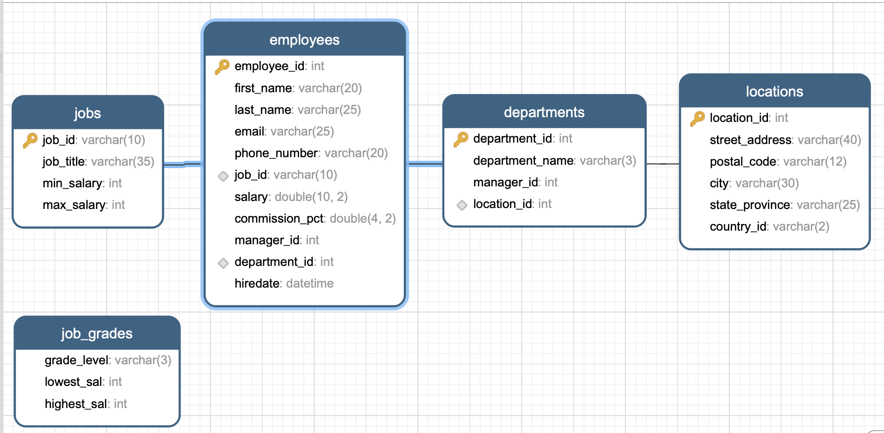
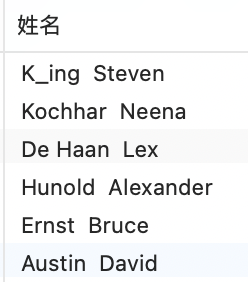

# MYSQL基础语法

## DQL语言

DQL语言即查询语句

现在我们有如下几张表，用作示例：



### 基础查询     

- 在**employees**表中查询一个字段**last_name**

```DQL
SELECT last_name 
FROM employees;
```
同理多个字段

- 为查询字段起别名(使用AS或者空格)

- MYSQL中 + 号仅为运算符
  
  - 字符串会转换成数值型进行运算
   
    - 字符串不为数字时，转换为0
  
    - 其中一方为null时，结果为null
    
  - 字符串的连接考虑使用CONCAT 

```DQL
SELECT 
	CONCAT(last_name,"  ",first_name) AS 姓名
FROM
	employees;
```
结果如图:


### 条件查询

一、按条件表达式筛选

	简单条件运算符：> 大于 、 < 小于、 = != <> >= <=
	
	二、按逻辑表达式筛选
	逻辑运算符：
	作用：用于连接条件表达式
		&& || !
		and or not
		
	&&和and：两个条件都为true，结果为true，反之为false
	||或or： 只要有一个条件为true，结果为true，反之为false
	!或not： 如果连接的条件本身为false，结果为true，反之为false
	
	三、模糊查询
		like % _
		between and
		in
		is null
### 排序查询	

- 语法：
```DQL
	select
		要查询的东西
	from
		表
	where 
		条件
	
	order by 排序的字段|表达式|函数|别名 【asc|desc】
```
### 常见函数  

	一、单行函数
	1、字符函数
		concat   拼接
		substr   截取子串
		upper    转换成大写
		lower    转换成小写
		trim     去前后指定的空格和字符
		ltrim    去左边空格
		rtrim    去右边空格
		replace  替换
		lpad     左填充
		rpad     右填充
		instr    返回子串第一次出现的索引
		length   获取字节个数
		
	2、数学函数
		round    四舍五入
		rand     随机数
		floor    向下取整
		ceil     向上取整
		mod      取余
		truncate 截断
	3、日期函数
		now      当前系统日期+时间
		curdate  当前系统日期
		curtime  当前系统时间
		str_to_date 将字符转换成日期
		date_format 将日期转换成字符
	4、流程控制函数
		if 处理双分支
		case语句 处理多分支
			情况1：处理等值判断
			情况2：处理条件判断
		
	5、其他函数
		version版本
		database当前库
		user当前连接用户


### 分组函数

- sum 求和 
  
- max 最大值 
  
- min 最小值 
  
- avg 平均值 
  
- count 计数
  
- 特点：
  - 以上五个分组函数都忽略null值，除了count(*)
  - sum和avg一般用于处理数值型
  - max、min、count可以处理任何数据类型
  - 都可以搭配distinct使用，用于统计去重后的结果
  - count的参数可以支持： 字段、*、常量值，一般放1；建议使用 count(*)

### 分组查询
```DQL
select 查询列表
from 表
【where 筛选条件】
group by 分组的字段
【order by 排序的字段】;
```

### 连接查询

- 等值连接查询

- 非等值连接查询

### 子查询     

### 分页查询 

### union联合查询