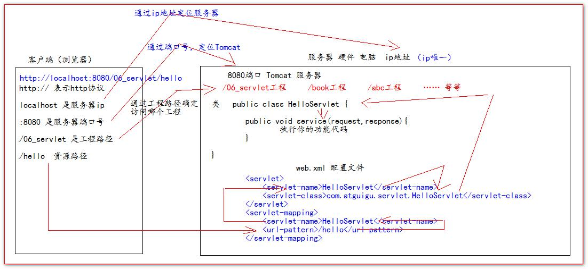
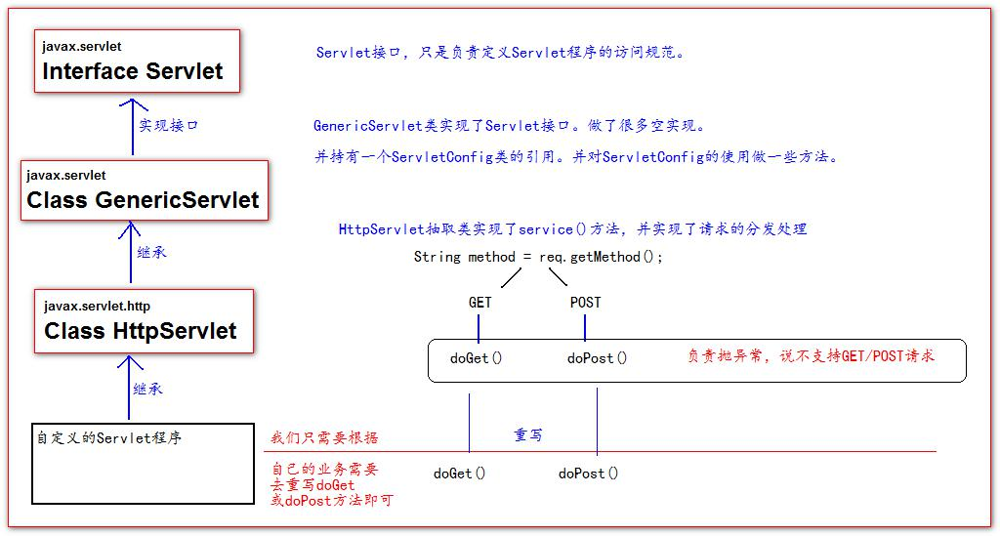
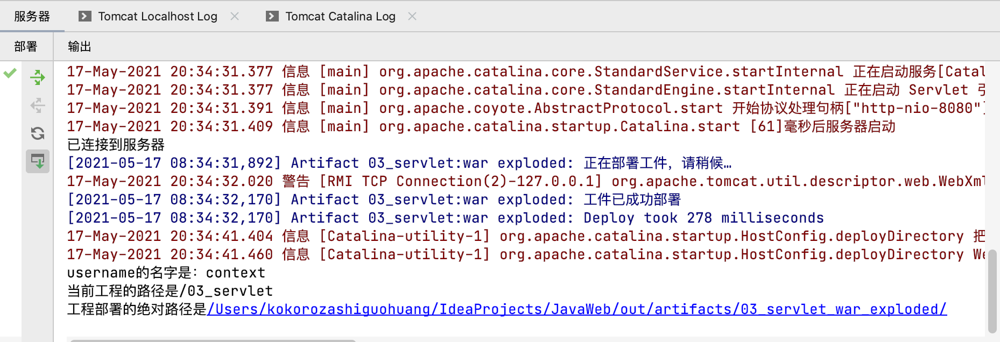
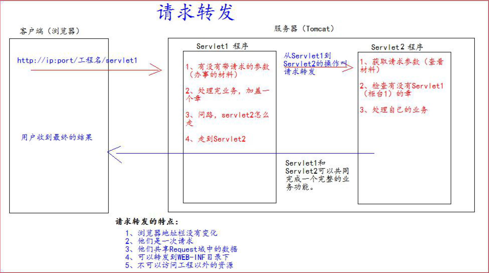
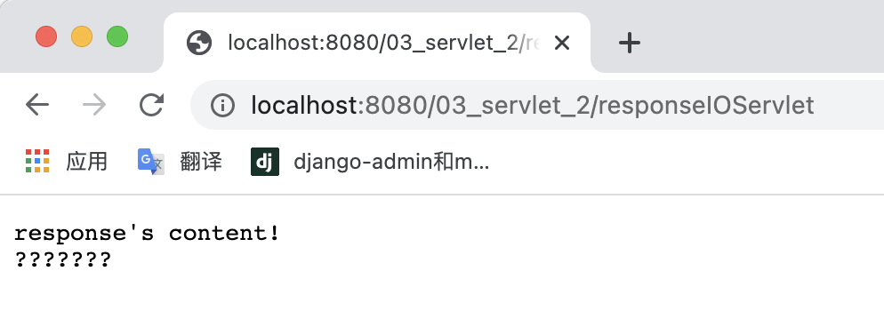
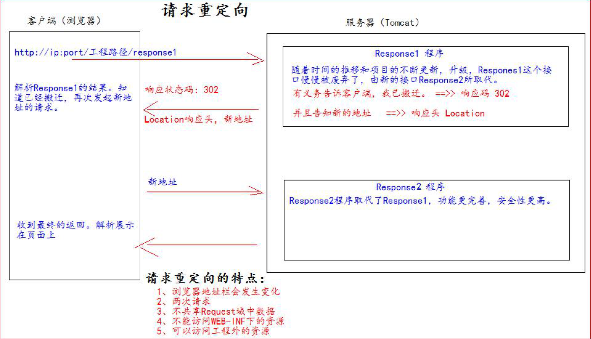

# Servlet

?> **Servlet** 是运行在 Web 服务器或应用服务器上的程序，

它是作为来自 Web 浏览器或其他 HTTP 客户端的请求和 HTTP 服务器上的数据库或应用程序之间的中间层。

>## Servlet技术

---

### 什么是Servlet

- **Servlet**是JavaEE规范之一，规范就是接口。

- **Servlet**就JavaWeb三大组件之一。三大组件分别是：**Servlet**程序、**Filter**过滤器、**Listener**监听器。

- **Servlet**是运行在服务器上的一个java小程序，它可以接收客户端发送过来的请求，并响应数据给客户端。

---

### 简单实现一个Servlet程序
(实现前需配置好Tomcat，这里不做赘述)

1、编写一个类去实现**Servlet**接口 

   实现**service**方法，处理请求，并响应数据
```java
public class HelloServlet implements Servlet {
/**
* service 方法是专门用来处理请求和响应的
* @param servletRequest
* @param servletResponse
* @throws ServletException
* @throws IOException
  */
  @Override
  public void service(ServletRequest servletRequest, ServletResponse servletResponse) 
          throws ServletException, IOException { 
      System.out.println("Hello Servlet 被访问了");
  }
}
```


2、到web.xml中去配置servlet程序的访问地址
```xml

<!-- servlet 标签给Tomcat 配置Servlet 程序-->
<servlet>
    <!--servlet-name 标签Servlet 程序起一个别名（一般是类名） -->
    <servlet-name>HelloServlet</servlet-name>
    <!--servlet-class 是Servlet 程序的全类名-->
    <servlet-class>com.zhiguo.servlet.HelloServlet</servlet-class>
</servlet>

<!--servlet-mapping 标签给servlet 程序配置访问地址-->
<servlet-mapping>
    <!--servlet-name 标签的作用是告诉服务器，我当前配置的地址给哪个Servlet 程序使用-->
    <servlet-name>HelloServlet</servlet-name>
    <!--url-pattern 标签配置访问地址<br/>
        / 斜杠在服务器解析的时候，表示地址为：http://ip:port/工程路径<br/>
        /hello 表示地址为：http://ip:port/工程路径/hello <br/>
        -->
    <url-pattern>/hello</url-pattern>
</servlet-mapping>
```

---


### url 地址到 Servlet 程序的访问



---


### Servlet 的生命周期

- 执行**Servlet构造器方法**
```java
  public HellowServlet() {
  
  }
  ```
其中`HellowServlet`为类名


- 执行**init初始化方法**
  (执行构造器和初始化方法是在第一次访问的时候创建 Servlet 程序会调用。)
```java
    public void init(ServletConfig servletConfig) throws ServletException {

    }
```


- 执行**Service方法**
  (执行Servlet方法每次访问都会调用。)
```java
public void service(ServletRequest servletRequest, ServletResponse servletResponse) throws ServletException, IOException {

        }
```


- 执行**destroy销毁方法**
  (销毁方法，在web工程停止的时候调用。)
```java
public void destroy() {

        }
```

---


### 通过继承 HttpServlet 实现Servlet 程序

一般在实际项目开发中，都是使用继承**HttpServlet**类的方式去实现**Servlet**程序。

1、编写一个类去继承**HttpServlet**类

2、根据业务需要重写`doGet`或`doPost`方法
```java
public class HelloServlet2 extends HttpServlet {
/**
* doGet（）在get 请求的时候调用
* @param req
* @param resp
* @throws ServletException
* @throws IOException
  */
  @Override
  protected void doGet(HttpServletRequest req, HttpServletResponse resp) throws ServletException,
  IOException { 
      System.out.println("HelloServlet2 的doGet 方法");
  }
  /**
* doPost（）在post 请求的时候调用
* @param req
* @param resp
* @throws ServletException
* @throws IOException
  */
  @Override
  protected void doPost(HttpServletRequest req, HttpServletResponse resp) throws ServletException,
  IOException { 
      System.out.println("HelloServlet2 的doPost 方法");
  }
}
 ```

3、到web.xml中配置Servlet程序的访问地址

```xml
<servlet>
    <servlet-name>HelloServlet2</servlet-name>
    <servlet-class>com.zhiguo.servlet.HelloServlet2</servlet-class>
</servlet>

<servlet-mapping>
    <servlet-name>HelloServlet2</servlet-name>
    <url-pattern>/hello2</url-pattern>
</servlet-mapping>
```

---


### Servlet 类的继承体系




>## ServletConfig 类

---


### 什么是ServletConfig 类

**Servlet**程序和**ServletConfig**对象都是由**Tomcat**负责创建，我们负责使用。

**Servlet**程序默认是第一次访问的时候创建，**ServletConfig**是每个**Servlet**程序创建时，
就创建一个对应的**ServletConfig**对象。

---


### ServletConfig 类的三大作用
- 可以获取Servlet 程序的别名``servlet-name``的值

- 获取初始化参数``init-param``

- 获取**ServletContext**对象

web.xml 中的配置：
```xml
<!-- servlet 标签给Tomcat 配置Servlet 程序-->
<servlet>
    <!--servlet-name 标签Servlet 程序起一个别名（一般是类名） -->
    <servlet-name>HelloServlet</servlet-name>
    <!--servlet-class 是Servlet 程序的全类名-->
    <servlet-class>com.zhiguo.servlet.HelloServlet</servlet-class>

    <!--init-param 是初始化参数-->
    <init-param>
        <!--是参数名-->
        <param-name>username</param-name>
        <!--是参数值-->
        <param-value>root</param-value>
    </init-param>

    <!--init-param 是初始化参数-->
    <init-param>
        <!--是参数名-->
        <param-name>url</param-name>
        <!--是参数值-->
        <param-value>jdbc:mysql://localhost:3306/test</param-value>
    </init-param>
</servlet>

<!--servlet-mapping 标签给servlet 程序配置访问地址-->
<servlet-mapping>
  <!--servlet-name 标签的作用是告诉服务器，我当前配置的地址给哪个Servlet 程序使用-->
  <servlet-name>HelloServlet</servlet-name>
  <!--
  url-pattern 标签配置访问地址<br/>
  / 斜杠在服务器解析的时候，表示地址为：http://ip:port/工程路径<br/>
  /hello 表示地址为：http://ip:port/工程路径/hello <br/>
  -->
  <url-pattern>/hello</url-pattern>
</servlet-mapping>
```

**Servlet**程序中的代码

```java
public void init(ServletConfig servletConfig) throws ServletException {
    System.out.println("2 init 初始化方法");
// 1、可以获取Servlet 程序的别名servlet-name 的值
    System.out.println("HelloServlet 程序的别名是:" + servletConfig.getServletName());
// 2、获取初始化参数init-param
    System.out.println("初始化参数username 的值是;" + servletConfig.getInitParameter("username"));
    System.out.println("初始化参数url 的值是;" + servletConfig.getInitParameter("url"));
// 3、获取ServletContext 对象
    System.out.println(servletConfig.getServletContext());
}
```
**注意点**


>## ServletContext 类

---


### 什么是ServletContext 类

- **ServletContext**是一个接口，它表示**Servlet**上下文对象

- 一个**web**工程，只有一个**ServletContext**对象实例。

- **ServletContext**对象是一个域对象。

- **ServletContext**是在**web**工程部署启动的时候创建。**在web**工程停止的时候销毁。

什么是**域对象**?

域对象，是可以像Map一样存取数据的对象，叫域对象。

这里的域指的是存取数据的操作范围，整个web 工程。


---


### ServletContext 类的四个作用

- 获取web.xml 中配置的上下文参数``context-param``

- 获取当前的工程路径，格式: /工程路径

- 获取工程部署后在服务器硬盘上的绝对路径

- 像Map一样存取数据

ServletContext 演示代码

```java
protected void doGet(HttpServletRequest request, HttpServletResponse response) throws ServletException, IOException {

         //获取web.xml中配置上下文的参数context——param
        ServletContext context = getServletConfig().getServletContext();

        String username = context.getInitParameter("username");
        System.out.println("username的名字是："+username);

        //获取当前工程的路径
        System.out.println("当前工程的路径是"+context.getContextPath());

        //获取工程部署后在服务器硬盘上的绝对路径
        /**
         *  /斜杠被服务器解析地址为 http://ip:port/工程名/  映射到idea上的web目录</br>
         */
        System.out.println("工程部署的绝对路径是"+ context.getRealPath("/"));
    }
```
```java
protected void doGet(HttpServletRequest request, HttpServletResponse response) throws ServletException, IOException {
        
        //获取servletcontext对象
        ServletContext context = getServletContext();
        context.setAttribute("key1","value");
        System.out.println("context数据域中key1的值是"+context.getAttribute("key1"));
}
```

web.xml里的配置
```xml
<!--context-param 是上下文参数(它属于整个web 工程)-->
<context-param>
    <param-name>username</param-name>
    <param-value>context</param-value>
</context-param>
<!--context-param 是上下文参数(它属于整个web 工程)-->

```
>后续关于Web.xml的相同、类似的配置不再赘述

服务器端结果




>## HttpServletRequest类
---
### HttpServletRequest类 的作用
每次只要有请求进入**Tomcat**服务器，**Tomcat**服务器就会把请求过来的**HTTP**协议信息解析好封装到Request 对象中。

然后传递到**service**方法（`doGet` 和`doPost`）中给我们使用。

我们可以通过**HttpServletRequest**对象，获取到所有请求的
信息。
---
### HttpServletRequest类的常用方法

**HttpServletRequest**类有如下几个常用的Api:

- `getRequestURI()` 获取请求的资源路径
  
- `getRequestURL()`获取请求的统一资源定位符（绝对路径）
  
- `getRemoteHost()`获取客户端的ip 地址
  
- `getHeader()`获取请求头
  
- `getParameter()`获取请求的参数
  
- `getParameterValues()`获取请求的参数（多个值的时候使用）
  
- `getMethod()`获取请求的方式GET 或POST
  
- `setAttribute(key, value)`设置域数据
  
- `getAttribute(key)`获取域数据
  
- `getRequestDispatcher()`获取请求转发对象
---
### 请求的转发

什么是请求的转发?

**请求转发**是指，服务器收到请求后，从一次资源跳转到另一个资源的操作。




>## HttpServletResponse类

---

### HttpServletResponse类的作用

**HttpServletResponse**类和**HttpServletRequest**类一样。

每次请求进来，**Tomcat**服务器都会创建一个**Response**对象传递给**Servlet**程序去使用。

**HttpServletRequest**表示请求过来的信息，**HttpServletResponse**表示所有响应的信息，
我们如果需要设置返回给客户端的信息，都可以通过**HttpServletResponse**对象来进行设置。

### 两个输出流的说明

- 字节流
`getOutputStream()`常用于下载（传递二进制数据）
  
- 字符流
  `getWriter()` 常用于回传字符串（常用）

**两个流同时只能使用一个。**

### 如何往客户端传送数据
```java
public class ResponseIOServlet extends HttpServlet {

  @Override
  protected void doGet(HttpServletRequest req, HttpServletResponse resp) throws ServletException, IOException {
      
    //往客户端回传字符流
    PrintWriter writer = resp.getWriter();
    writer.println("response's content!");
    writer.println("国哥真的帅呀！");
  }
}
```



### 响应的乱码解决
我们在上面往客户端传送数据时会发现中文编码格式会存在问题

"**国哥真的帅呀！**"显示成了"**？？？？？？**"

这是因为服务器默认的编码格式为**ISO-8859-1**

我们可以分别通过`setCharacterEncoding()`、`setHeader()`和`setContentType()`两种方法来设置服务器和浏览器的编码格式
```java
public class ResponseIOServlet extends HttpServlet {

    @Override
    protected void doGet(HttpServletRequest req, HttpServletResponse resp) throws ServletException, IOException {

        //System.out.println(resp.getCharacterEncoding()); //默认ISO-8859-1

        //设置服务器字符集为UTF-8
        // resp.setCharacterEncoding("UTF-8");

        //通过响应头，设置浏览器也使用UTF-8字符集
        // resp.setHeader("Content-Type","text/html;charset=UTF-8");

        //同时设置服务器和客户端为UTF-8字符集，还设置了响应头
        //在获取流对象前调用才有效
        resp.setContentType("text/html;charset=UTF-8");


        //往客户端回传字符流
        PrintWriter writer = resp.getWriter();
        writer.println("response's content!");
        writer.println("国哥真的帅呀！");
    }
}
```
>推荐使用`setContentType()`一步到位

此时访问浏览器会发现


**"国哥真的帅呀！"**显示出来了!

### 请求重定向

**请求重定向**，是指客户端给服务器发请求，然后服务器告诉客户端说。我给你一些地址。你去新地址访问。
叫请求重定向（因为之前的地址可能已经被废弃）



实现代码如下:

