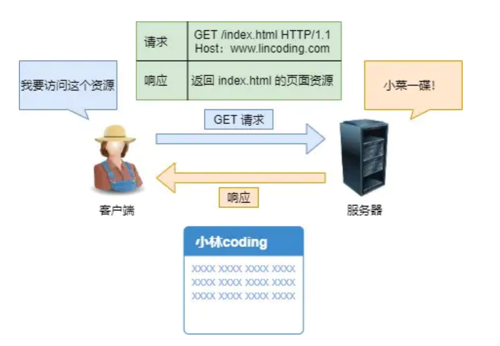
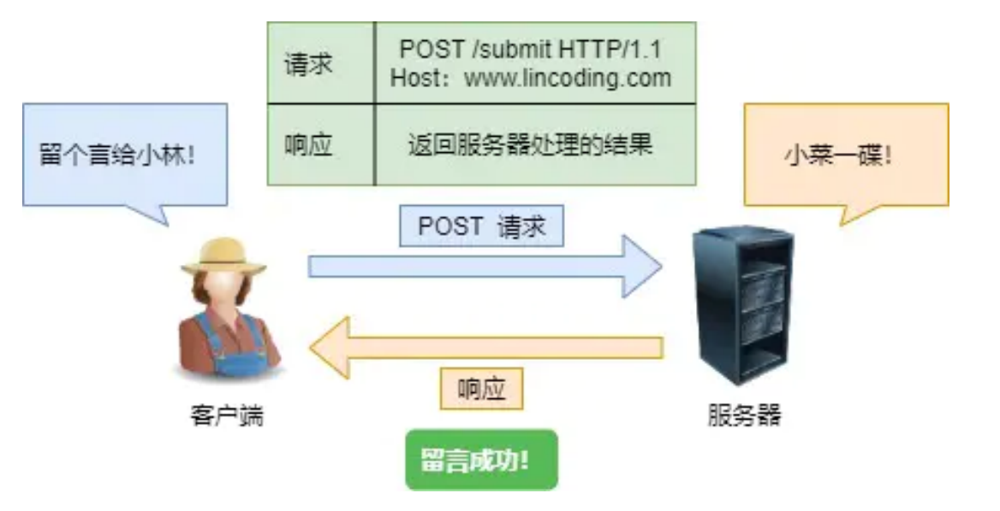
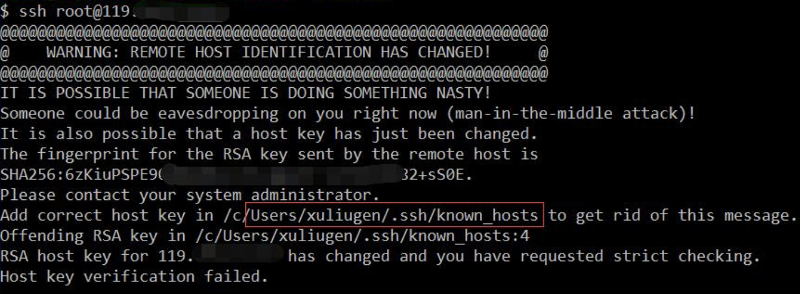
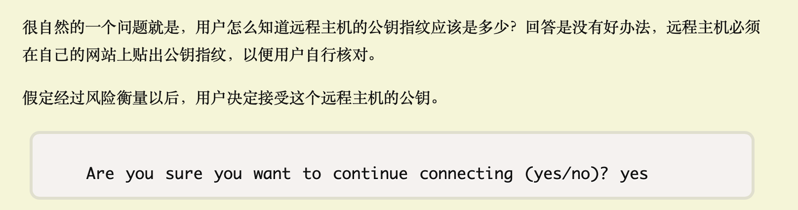

# 2021

随笔一栏用来记录我日常学习中的一些学习心得体会和总结

---

## 6.3

今天看了看公众号博主`小林coding`的**《图解网络》**一书，发现上面内容大多都是课本中未曾提及的、面向工作和实际的一些网络知识。

那首先就对今天学到的知识进行一个复盘和总结吧。

### Get 和 Post

在学习JavaWeb知识的时候已经遇见过很多`doget`、`dopost`方法了，那么什么是`Get`和`Post`呢？，今天才了解到**内幕**。

- Get方法

`Get`⽅法的含义是请求从**服务器获取资源**，这个资源可以是静态的⽂本、⻚⾯、图⽚视频等。

>举个栗子，你打开网站，网站返回你所需要的数据，get！
 

Get请求的过程涉及到:

1、当浏览器(客户端)向服务器**发送请求时**，浏览器会把http header和data一并发送出去，

2、当服务器接收到这些服务器请求数据时，**响应200（返回数据）**。

3、浏览器发送的数据对服务器进行了**读**操作

在这个过程中，浏览器(客户端)仅仅产生了**一次**TCP数据报

- Post方法

`POST`⽅法则是相反操作，它向**URI指定的资源提交数据**，数据就放在报⽂的body⾥。

>再举个栗子，你在朋友圈里评论了，浏览器就会执⾏⼀次 POST 请求，把你的
评论⽂字放进了报⽂body⾥，然后拼接好POST请求头，通过TCP协议发送给服务器。

Post请求的过程涉及到:

1、浏览器先发送header，服务器响应100 continue，

2、浏览器再发送data，服务器响应**200（返回数据**）。

3、浏览器发送的数据对服务器进行了**写**操作，即修改了服务器的内容(可以这么讲吧？)。

这个过程中，浏览器(客户端)产生了**两次**TCP数据报。

`Get`和`Post`区别：

- `Get`请求只产生一次TCP数据报

  `Post`请求产生两次TCP数据报
  
- 在网络条件好的情况下，`Get`和`Post`请求速度差不多(但是Get理论上还是快一点)
  
  在网络条件不好的情况下，发送**两次**TCP数据报的`Post`请求对**验证数据包的完整性**有更大的优点。

- W3C规定，`Get`是往客户端向服务器获取数据的(Get也能向服务器发送数据，但是不建议这么做)，
  
 `Post`是客户端往服务器提交数据(涉及到了一个安全的问题).

图片引用自:小林coding里的《图解网络》

## 6.4

### SSH连接

今天尝试搭建一个自己的博客网站，因为doscify有点拉垮(写下这篇的时候还在用doscify...)

打算用的是阿里云的服务器+国内的域名+wordpress。

在用宝塔一步到位之前，用**ssh**远程操控服务器的时候遇到一个有意思的问题，现在来复述一下这个问题:

- 在命令行使用`ssh root@139.xxx.xxx.xx`远程连接我的公网ip地址，远程下载数据库等操作时，这一切都没问题

- 然后因为看教程使用的是centos而我购买服务器时默认的是aliyunos，在我**重启服务器更换操作系统**后(此时原服务器上的数据已经无了)，
再在命令行里输入`ssh root@139.xxx.xxx.xx`后，会提示

- 上网查看解决方法时，可以`#vi ~/.ssh/known_hosts`，其中`known_hosts`为服务器的ip地址，然后再`ssh root@139.xxx.xxx.xx`就可以成功连接服务器了。

这里面有两个疑问，

1、为什么**重启服务器更换操作系统**后连接会失败？其中前后**服务器的公网ip地址是不变**的

2、为什么`#vi ~/.ssh/known_hosts`后就可以连接成功了？

然后看完了**阮一峰**大大的`SSH原理与运用（一）：远程登录`并且查阅了一些资料后，找到了答案。

- 会导致这一警告信息(连接失败)是因为，第一次进行SSH连接时，会生成一个**认证(服务器的公匙)**
存储在客户端中的known_hosts(存放可信赖远程主机的公匙)，
但如果服务器**重新装过或认证信息发生变化**。这时候服务器和客户端的信息不匹配时(此时发来的**新服务器公钥**和客户端中的**旧服务器公钥**不匹配)，
就会出现错误。

- 解决办法就是将known_hosts文件中那个无效的记录删除即可，即`#vi ~/.ssh/known_hosts`，然后再次`ssh root@139.xxx.xxx.xx`时，就会想第一次一样接受服务器的公钥，

由于SSH没有CA认证，所以第一次连接时服务器发来的公钥存在`中间人攻击`的危险。

关于其他更详细的内容，就不再多说了，毕竟这只是**学习随笔嘛**(不是因为懒)

有机会想写写**HTTPS加密**的，估计又是个大坑。。。

## 6.5

### 复习Java

感觉自己的基础还是不太好，这个月得补一补基础了，特别是Java部分的，毕竟是要靠这个吃饭的，哈哈

## 6.6

### 帮禧羊羊搭建服务器

今天劝说禧羊羊去白嫖了一个服务器，顺便帮他搭建了一下环境，之后复习了一下计网的知识，然后就去玩耍了，周末还是要休息的～

## 6.7

### 项目

明天又要开组会了，今天把上次安排的任务做了做，今晚估计勉勉强强做完，花了一个晚上都在做一个功能的增添，得出一个教训，以后不写注释是XX!

## 6.8

###新项目

原来的项目已经结题了，老师说这个项目先放置一会。先去做一个新项目的原型系统，新项目用的`layui组件`，
`layui组件`只用到了jQuery，比某饿了吗ui舒服多了(我比较菜还没学Vue。。。)，老师还说让我后天交流一下大概的设计思路。
这里面用到了数据库，虽然还没学但是**梭哈大法**保平安！

## 6.9

### 新项目

今天又开了一次会，和隔壁组分开做两套原型系统，周末的时候再开个会碰一碰(本来是明天碰一碰的。。。)。今天已经把大致的前端UI页面做完了，
对还未完成的页面有了一个构思，明天开始看看数据库。(不是我说，虽然组里的小伙伴们有点拉跨，单靠我一个人还是能做完的)

